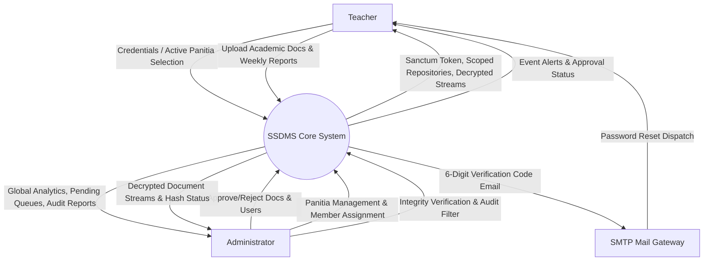
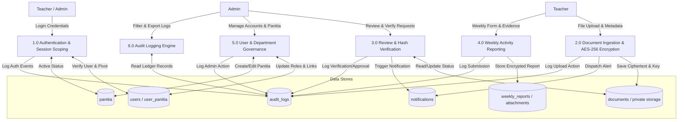
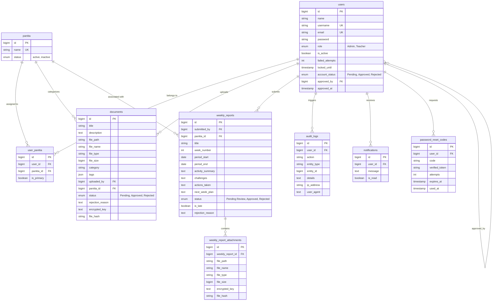

# SECURE SCHOOL DOCUMENT MANAGEMENT SYSTEM (SSDMS)
## Design, Development, and Evaluation for SMK Kubor Panjang
### Academic Report: Chapter 4 (Design & Implementation), Chapter 5 (Findings), and Chapter 6 (Conclusion and Recommendations)

**Author:** Harith Fiqri Bin Subri (Matric No: AM2505018881)  
**Supervisor:** Puan Roslinda Binti Murad  
**Institution:** Sekolah Menengah Kebangsaan (SMK) Kubor Panjang  
**Course Code:** FYP4025 Computing Project 2 / Final Year Project  

---

# TABLE OF CONTENTS

* [4 DESIGN & IMPLEMENTATION](#4-design--implementation)
  * [4.1 Introduction](#41-introduction)
  * [4.2 Interface Design](#42-interface-design)
    * [4.2.1 Administrator Interface Design](#421-administrator-interface-design)
    * [4.2.2 Teacher Interface Design](#422-teacher-interface-design)
    * [4.2.3 Mobile & Responsive Interface Design](#423-mobile--responsive-interface-design)
  * [4.3 Database Design](#43-database-design)
    * [4.3.1 Data Dictionary](#431-data-dictionary)
    * [4.3.2 Data Flow Diagram (DFD)](#432-data-flow-diagram-dfd)
    * [4.3.3 Entity Relationship Diagram (ERD)](#433-entity-relationship-diagram-erd)
  * [4.4 Security System Framework](#44-security-system-framework)
  * [4.5 Implementation Introduction](#45-implementation-introduction)
  * [4.6 Execution Platform](#46-execution-platform)
    * [4.6.1 Development Platform](#461-development-platform)
    * [4.6.2 Hosting Platform](#462-hosting-platform)
  * [4.7 Implementation Tools](#47-implementation-tools)
    * [4.7.1 Software and Frameworks](#471-software-and-frameworks)
    * [4.7.2 Programming Languages](#472-programming-languages)
  * [4.8 System Interface and Modules](#48-system-interface-and-modules)
  * [4.9 Significant Functions and Security Algorithms](#49-significant-functions-and-security-algorithms)
    * [4.9.1 Core Functional Algorithms](#491-core-functional-algorithms)
    * [4.9.2 Security Mechanisms](#492-security-mechanisms)
  * [4.10 Conclusion](#410-conclusion)
* [5 FINDING](#5-finding)
  * [5.1 Introduction](#51-introduction)
  * [5.2 Testing](#52-testing)
  * [5.3 Non-Functional Testing](#53-non-functional-testing)
    * [5.3.1 Performance Testing](#531-performance-testing)
    * [5.3.2 Security Testing](#532-security-testing)
    * [5.3.3 Usability Testing](#533-usability-testing)
    * [5.3.4 Reliability Testing](#534-reliability-testing)
  * [5.4 Functional Testing](#54-functional-testing)
    * [5.4.1 Unit Testing](#541-unit-testing)
    * [5.4.2 Integration Testing](#542-integration-testing)
    * [5.4.3 System Testing](#543-system-testing)
  * [5.5 Acceptance Testing](#55-acceptance-testing)
    * [5.5.1 Client Acceptance Testing (CAT)](#551-client-acceptance-testing-cat)
    * [5.5.2 User Acceptance Testing (UAT)](#552-user-acceptance-testing-uat)
  * [5.6 Conclusion](#56-conclusion)
* [6 CONCLUSION](#6-conclusion)
  * [6.1 Introduction](#61-introduction)
  * [6.2 Project Schedule](#62-project-schedule)
    * [6.2.1 Work Breakdown Structure (WBS)](#621-work-breakdown-structure-wbs)
    * [6.2.2 Gantt Chart](#622-gantt-chart)
  * [6.3 Risk Management](#63-risk-management)
  * [6.4 Achievement of Project Objectives](#64-achievement-of-project-objectives)
    * [6.4.1 Objective 1: Implement Strict Role-Based and Department-Based Access Control](#641-objective-1-implement-strict-role-based-and-department-based-access-control-rbac--dbac)
    * [6.4.2 Objective 2: Ensure Cryptographic Confidentiality and File Tamper Detection](#642-objective-2-ensure-cryptographic-confidentiality-and-file-tamper-detection-aes-256--sha-256)
    * [6.4.3 Objective 3: Establish Document Approval Workflows, Weekly Activity Tracking, and Full Audit Accountability](#643-objective-3-establish-document-approval-workflows-weekly-activity-tracking-and-full-audit-accountability)
  * [6.5 Constraints and Limitations](#65-constraints-and-limitations)
  * [6.6 Future Work and Recommendations](#66-future-work-and-recommendations)
  * [6.7 Final Summary](#67-final-summary)

---

# 4 DESIGN & IMPLEMENTATION

## 4.1 Introduction

This chapter details the design principles, architectural modeling, and implementation strategies employed in developing the **Secure School Document Management System (SSDMS)** for **Sekolah Menengah Kebangsaan (SMK) Kubor Panjang**. In the Software Development Life Cycle (SDLC), the Design and Implementation phase serves as the bridge between theoretical requirements and a functional, production-ready software solution.

Prior to the inception of SSDMS, SMK Kubor Panjang relied on physical paper filing cabinets and unmanaged shared network folders (such as Google Drive). These traditional approaches exhibited critical security vulnerabilities, including weak access boundaries between academic departments, absence of tamper detection, lack of administrative approval oversight, and complete lack of verifiable audit trails. 

To overcome these institutional vulnerabilities, SSDMS was designed around a **multi-layered, defense-in-depth security paradigm** coupled with a decoupled, modern web architecture. The backend is powered by the **Laravel 12 (PHP 8.2+)** RESTful framework, while the frontend is constructed as a modern Single Page Application (SPA) utilizing **React 18, TypeScript, and Vite**. Cryptographic security is anchored on **OpenSSL AES-256-CBC envelope encryption** at rest, **SHA-256 cryptographic integrity verification**, **Role-Based Access Control (RBAC)**, and **Department-Based Access Control (DBAC / Panitia scoping)**.

This chapter systematically outlines the user interface design, database design (data dictionary, DFDs, and ERD), security system framework, execution platform, implementation toolchain, detailed system modules, and significant algorithms and code implementations.

---

## 4.2 Interface Design

User Interface (UI) and User Experience (UX) design play a pivotal role in ensuring that security controls do not hinder administrative efficiency or teacher productivity. The interface was conceptualized using wireframes and modern design principles prior to implementation, ensuring clear visual hierarchy, accessible contrast, and intuitive navigation for school personnel with varying degrees of technical proficiency.

The design architecture incorporates a unified layout comprising:
1. **Collapsible Navigation Sidebar:** Provides role-specific navigation links tailored dynamically to Administrator or Teacher privileges.
2. **Global Header & Action Topbar:** Displays active institutional branding, dynamic *Panitia* department switcher, real-time unread notification badge, Light/Dark theme toggle, and authenticated user menu.
3. **Responsive Main Viewport:** Contains structured panels, metric summary cards, filtered data tables, and modal overlays.

### 4.2.1 Administrator Interface Design
The Administrator interface was crafted to provide global system oversight, real-time metrics, and streamlined approval controls:
* **System Overview Dashboard:** Features high-level Key Performance Indicator (KPI) cards displaying total, pending, approved, and rejected document counts; active teacher registrations; subject department counts; weekly report submission compliance; and an active feed of the 10 most recent audit log entries.
* **Document Approval Queue:** Displays pending document submissions across all departments in a structured table. Each entry provides file metadata, category tags, submitting educator profile, and quick-action buttons allowing immediate inline file preview, one-click approval, or rejection with mandatory textual feedback.
* **User Management Console:** Offers tabular visibility of all system accounts, segregated into 'Active Users' and 'Pending Registrations' tabs. Provides administrators with controls to approve new accounts, assign primary and secondary *Panitia* memberships, toggle account active status, or reset credentials.
* **Panitia (Department) Management:** Enables administrators to create new academic departments, deactivate obsolete departments, assign or reassign teaching staff, and designate primary departmental affiliations.
* **Audit Trail Ledger:** An immutable, searchable data table tracking every system event with multi-criteria filtering by action type, user actor, and date range, complemented by an instantaneous CSV export engine.

### 4.2.2 Teacher Interface Design
The Teacher interface is strictly departmentalized to eliminate visual clutter and safeguard academic confidentiality:
* **Department Selection Gateway (`/select-panitia`):** For teachers assigned to multiple subject departments, a dedicated post-login gateway presents interactive department cards, prompting the educator to establish their active session scope before accessing records.
* **Teacher Overview Dashboard:** Scoped strictly to the teacher's active *Panitia*, displaying personal document submission statuses, active submission window notifications, and quick links to upload new materials.
* **Document Upload & Ingestion Interface:** Features an intuitive drag-and-drop file dropzone accepting PDF, DOCX, DOC, and image formats up to 10 MB, accompanied by metadata input fields (Title, Category, Tags, Description, and target Panitia).
* **Document Repository & Search:** A paginated file repository with real-time keyword search and category filtering, enabling teachers to locate, preview, and download approved department materials.
* **Weekly Activity Report Submission:** A structured, multi-field form enabling teachers to document weekly curriculum progress, student learning challenges, corrective interventions, and forward planning, with multi-file encrypted attachment support.

### 4.2.3 Mobile & Responsive Interface Design
Recognizing that teachers frequently access administrative records on mobile smartphones and tablets in classrooms or during staff meetings, the interface was engineered with fluid responsiveness:
* **Mobile Breakpoint Adaptation ($\le$ 768px):** The desktop sidebar collapses into a slide-over mobile drawer toggled via a topbar hamburger button.
* **Data Table Horizontal Responsiveness:** Complex data tables are encapsulated in responsive overflow wrappers with subtle gradient fade indicators, ensuring readability without horizontal page breaking.
* **Touch-Friendly Hit Targets:** Interactive elements, action buttons, and modal dialog controls maintain a minimum touch target height of 44px in compliance with mobile accessibility guidelines.
* **Theme System (Dark / Light Mode):** A CSS custom-property design system enables users to toggle between a clean slate-white theme and an eye-friendly dark navy theme (`#0F172A`), preserving high-contrast text ratios for evening grading sessions.

---

## 4.3 Database Design

SSDMS utilizes a normalized relational database schema implemented on the **MySQL 8.0** engine. The schema is engineered to ensure strict referential integrity, eliminate data redundancy, enforce cascade behaviors on user relationships, and store encrypted payloads alongside cryptographic metadata.

### 4.3.1 Data Dictionary

The SSDMS relational database comprises nine (9) primary tables. The complete data dictionary for all entities is detailed in Tables 4.1 through 4.9.

#### Table 4.1: `users` Table Schema
Stores master account credentials, role classifications, security states, and administrative approval tracking.

| Field Name | Data Type | Length | Nullable | Key | Default | Description |
| :--- | :--- | :---: | :---: | :---: | :---: | :--- |
| `id` | BIGINT UNSIGNED | 20 | No | PK | Auto-inc | Unique user identifier |
| `name` | VARCHAR | 255 | No | - | - | Full legal name of educator or administrator |
| `username` | VARCHAR | 50 | Yes | Unique | NULL | Unique alphanumeric login username |
| `email` | VARCHAR | 255 | No | Unique | - | Official email address for authentication |
| `email_verified_at` | TIMESTAMP | - | Yes | - | NULL | Email verification timestamp |
| `password` | VARCHAR | 255 | No | - | - | Bcrypt-hashed password string |
| `role` | ENUM | - | No | - | 'Teacher' | System access role: `'Admin'` or `'Teacher'` |
| `is_active` | BOOLEAN | 1 | No | - | 1 (True) | Account activation flag |
| `failed_attempts` | INT | 11 | No | - | 0 | Consecutive failed login counter |
| `locked_until` | TIMESTAMP | - | Yes | - | NULL | Account lockout expiration timestamp |
| `account_status` | ENUM | - | No | - | 'Pending' | Status: `'Pending'`, `'Approved'`, `'Rejected'` |
| `approved_by` | BIGINT UNSIGNED | 20 | Yes | FK | NULL | Reference to `users.id` who approved account |
| `approved_at` | TIMESTAMP | - | Yes | - | NULL | Timestamp of administrative approval |
| `remember_token` | VARCHAR | 100 | Yes | - | NULL | Session persistence token |
| `created_at` | TIMESTAMP | - | Yes | - | NULL | Record creation timestamp |
| `updated_at` | TIMESTAMP | - | Yes | - | NULL | Record update timestamp |

#### Table 4.2: `panitia` Table Schema
Defines the academic subject departments at SMK Kubor Panjang.

| Field Name | Data Type | Length | Nullable | Key | Default | Description |
| :--- | :--- | :---: | :---: | :---: | :---: | :--- |
| `id` | BIGINT UNSIGNED | 20 | No | PK | Auto-inc | Unique department identifier |
| `name` | VARCHAR | 255 | No | Unique | - | Name of Panitia (e.g., Bahasa Melayu, Science) |
| `status` | ENUM | - | No | - | 'active' | Department status: `'active'` or `'inactive'` |
| `created_at` | TIMESTAMP | - | Yes | - | NULL | Record creation timestamp |
| `updated_at` | TIMESTAMP | - | Yes | - | NULL | Record update timestamp |

#### Table 4.3: `user_panitia` Pivot Table Schema
Maps the many-to-many relationship between educators and subject departments.

| Field Name | Data Type | Length | Nullable | Key | Default | Description |
| :--- | :--- | :---: | :---: | :---: | :---: | :--- |
| `id` | BIGINT UNSIGNED | 20 | No | PK | Auto-inc | Unique pivot record identifier |
| `user_id` | BIGINT UNSIGNED | 20 | No | FK | - | Foreign key referencing `users.id` (Cascade) |
| `panitia_id` | BIGINT UNSIGNED | 20 | No | FK | - | Foreign key referencing `panitia.id` (Cascade) |
| `is_primary` | BOOLEAN | 1 | No | - | 0 (False) | Indicates educator's primary subject Panitia |
| `created_at` | TIMESTAMP | - | Yes | - | NULL | Record creation timestamp |
| `updated_at` | TIMESTAMP | - | Yes | - | NULL | Record update timestamp |

#### Table 4.4: `documents` Table Schema
Stores document metadata, workflow status, encrypted file references, and cryptographic keys.

| Field Name | Data Type | Length | Nullable | Key | Default | Description |
| :--- | :--- | :---: | :---: | :---: | :---: | :--- |
| `id` | BIGINT UNSIGNED | 20 | No | PK | Auto-inc | Unique document identifier |
| `title` | VARCHAR | 255 | No | - | - | Title of academic document |
| `description` | TEXT | - | Yes | - | NULL | Abstract or description of document contents |
| `file_path` | VARCHAR | 255 | No | - | - | Storage path in `storage/app/private/documents/` |
| `file_name` | VARCHAR | 255 | No | - | - | Original uploaded file name |
| `file_type` | VARCHAR | 255 | No | - | - | MIME type (e.g., application/pdf) |
| `file_size` | BIGINT UNSIGNED | 20 | Yes | - | NULL | File size in bytes |
| `category` | VARCHAR | 100 | No | - | - | Document category (e.g., Exam, Assessment) |
| `tags` | JSON / TEXT | - | Yes | - | NULL | Array of descriptive metadata tags |
| `uploaded_by` | BIGINT UNSIGNED | 20 | No | FK | - | Foreign key referencing `users.id` |
| `panitia_id` | BIGINT UNSIGNED | 20 | Yes | FK | NULL | Foreign key referencing `panitia.id` |
| `status` | ENUM | - | No | - | 'Pending' | Workflow status: `'Pending'`, `'Approved'`, `'Rejected'` |
| `rejection_reason` | TEXT | - | Yes | - | NULL | Administrative feedback upon document rejection |
| `encrypted_key` | TEXT | - | No | - | - | Base64-encoded AES-256 random encryption key |
| `file_hash` | VARCHAR | 64 | No | - | - | Plaintext SHA-256 integrity hash |
| `created_at` | TIMESTAMP | - | Yes | - | NULL | Record creation timestamp |
| `updated_at` | TIMESTAMP | - | Yes | - | NULL | Record update timestamp |

#### Table 4.5: `weekly_reports` Table Schema
Maintains structured weekly curriculum logs submitted by educators.

| Field Name | Data Type | Length | Nullable | Key | Default | Description |
| :--- | :--- | :---: | :---: | :---: | :---: | :--- |
| `id` | BIGINT UNSIGNED | 20 | No | PK | Auto-inc | Unique weekly report identifier |
| `submitted_by` | BIGINT UNSIGNED | 20 | No | FK | - | Foreign key referencing `users.id` |
| `panitia_id` | BIGINT UNSIGNED | 20 | Yes | FK | NULL | Foreign key referencing `panitia.id` |
| `title` | VARCHAR | 255 | No | - | - | Report title (e.g., Week 12 Progress Report) |
| `week_number` | INT UNSIGNED | 10 | No | - | - | Calendar ISO week number (1–53) |
| `period_start` | DATE | - | No | - | - | Start date of teaching week |
| `period_end` | DATE | - | No | - | - | End date of teaching week |
| `activity_summary` | TEXT | - | No | - | - | Summary of curriculum lessons conducted |
| `challenges` | TEXT | - | Yes | - | NULL | Pedagogical or student challenges encountered |
| `actions_taken` | TEXT | - | Yes | - | NULL | Corrective interventions implemented |
| `next_week_plan` | TEXT | - | Yes | - | NULL | Planned syllabus topics for subsequent week |
| `status` | ENUM | - | No | - | 'Pending Review' | Status: `'Pending Review'`, `'Approved'`, `'Rejected'` |
| `is_late` | BOOLEAN | 1 | No | - | 0 (False) | Flagged true if submitted outside weekend window |
| `rejection_reason` | TEXT | - | Yes | - | NULL | Feedback from administrative reviewer |
| `created_at` | TIMESTAMP | - | Yes | - | NULL | Record creation timestamp |
| `updated_at` | TIMESTAMP | - | Yes | - | NULL | Record update timestamp |

#### Table 4.6: `weekly_report_attachments` Table Schema
Manages encrypted evidence files attached to weekly reports.

| Field Name | Data Type | Length | Nullable | Key | Default | Description |
| :--- | :--- | :---: | :---: | :---: | :---: | :--- |
| `id` | BIGINT UNSIGNED | 20 | No | PK | Auto-inc | Unique attachment identifier |
| `weekly_report_id` | BIGINT UNSIGNED | 20 | No | FK | - | Foreign key referencing `weekly_reports.id` (Cascade) |
| `file_path` | VARCHAR | 255 | No | - | - | Storage path in `storage/app/private/weekly-reports/` |
| `file_name` | VARCHAR | 255 | No | - | - | Original uploaded file name |
| `file_type` | VARCHAR | 255 | No | - | - | MIME type (e.g., application/pdf, image/jpeg) |
| `file_size` | BIGINT UNSIGNED | 20 | Yes | - | NULL | File size in bytes |
| `encrypted_key` | TEXT | - | No | - | - | Base64-encoded AES-256 random encryption key |
| `file_hash` | VARCHAR | 64 | No | - | - | Plaintext SHA-256 integrity hash |
| `created_at` | TIMESTAMP | - | Yes | - | NULL | Record creation timestamp |
| `updated_at` | TIMESTAMP | - | Yes | - | NULL | Record update timestamp |

#### Table 4.7: `audit_logs` Table Schema
Immutable audit trail recording all security-relevant and administrative actions.

| Field Name | Data Type | Length | Nullable | Key | Default | Description |
| :--- | :--- | :---: | :---: | :---: | :---: | :--- |
| `id` | BIGINT UNSIGNED | 20 | No | PK | Auto-inc | Unique audit record identifier |
| `user_id` | BIGINT UNSIGNED | 20 | Yes | FK | NULL | Foreign key referencing `users.id` (Actor) |
| `action` | VARCHAR | 255 | No | - | - | Action identifier (e.g., `DOCUMENT_UPLOADED`) |
| `entity_type` | VARCHAR | 255 | Yes | - | NULL | Associated model class (e.g., Document, User) |
| `entity_id` | BIGINT UNSIGNED | 20 | Yes | - | NULL | Primary key ID of affected entity |
| `details` | TEXT | - | Yes | - | NULL | Contextual information or failure reason |
| `ip_address` | VARCHAR | 45 | Yes | - | NULL | IPv4 / IPv6 client network address |
| `user_agent` | TEXT | - | Yes | - | NULL | Client browser agent string |
| `created_at` | TIMESTAMP | - | Yes | - | NULL | Audit record creation timestamp |
| `updated_at` | TIMESTAMP | - | Yes | - | NULL | Record update timestamp |

#### Table 4.8: `notifications` Table Schema
Stores asynchronous in-app alerts dispatched to system users.

| Field Name | Data Type | Length | Nullable | Key | Default | Description |
| :--- | :--- | :---: | :---: | :---: | :---: | :--- |
| `id` | BIGINT UNSIGNED | 20 | No | PK | Auto-inc | Unique notification identifier |
| `user_id` | BIGINT UNSIGNED | 20 | No | FK | - | Foreign key referencing recipient `users.id` |
| `message` | TEXT | - | No | - | - | Notification message text |
| `is_read` | BOOLEAN | 1 | No | - | 0 (False) | Read status indicator |
| `created_at` | TIMESTAMP | - | Yes | - | NULL | Timestamp notification was generated |
| `updated_at` | TIMESTAMP | - | Yes | - | NULL | Timestamp notification was read |

#### Table 4.9: `password_reset_codes` Table Schema
Maintains single-use 6-digit verification codes for self-service password recovery.

| Field Name | Data Type | Length | Nullable | Key | Default | Description |
| :--- | :--- | :---: | :---: | :---: | :---: | :--- |
| `id` | BIGINT UNSIGNED | 20 | No | PK | Auto-inc | Unique reset request identifier |
| `user_id` | BIGINT UNSIGNED | 20 | No | FK | - | Foreign key referencing `users.id` |
| `code` | VARCHAR | 255 | No | - | - | Bcrypt-hashed 6-digit verification code |
| `verified_token` | VARCHAR | 80 | Yes | - | NULL | Ephemeral single-use token upon verification |
| `attempts` | INT | 11 | No | - | 0 | Failed verification attempt counter (max 5) |
| `expires_at` | TIMESTAMP | - | No | - | - | Code expiration timestamp (10-minute validity) |
| `used_at` | TIMESTAMP | - | Yes | - | NULL | Timestamp when password was successfully reset |
| `created_at` | TIMESTAMP | - | Yes | - | NULL | Timestamp code was dispatched |
| `updated_at` | TIMESTAMP | - | Yes | - | NULL | Record update timestamp |

---

### 4.3.2 Data Flow Diagram (DFD)

Data Flow Diagrams illustrate the architectural boundaries, process transformations, and data movements across SSDMS.

#### 4.3.2.1 Context Diagram (Level 0 DFD)
The Context Diagram defines the external entities interacting with the SSDMS system boundary:
* **Teacher:** Provides registration credentials, login inputs, department selections, document uploads, resubmissions, and weekly activity reports. Receives authentication tokens, notification alerts, scoped repository records, and decrypted document streams.
* **Administrator:** Provides user approval/rejection decisions, department assignments, document approval/rejection feedback, cryptographic verification requests, and audit search parameters. Receives global metrics, pending queues, verification results, and audit log exports.
* **SMTP Mail Server:** Receives password reset verification emails dispatched by the system for delivery to user inboxes.



#### 4.3.2.2 Level 1 Data Flow Diagram
The Level 1 DFD decomposes the central system into six core sub-processes:
1. **Process 1.0 (Authentication & Panitia Scoping):** Validates credentials, checks brute-force counters, issues Sanctum tokens, and binds the session to the selected `X-Active-Panitia` header.
2. **Process 2.0 (Document Ingestion & Envelope Encryption):** Generates a random 32-byte key, calculates the SHA-256 digest, encrypts via AES-256-CBC, and stores the ciphertext in private storage.
3. **Process 3.0 (Administrative Review & Verification):** Manages the pending approval queue, updates document state, triggers in-memory decryption for preview, and executes on-demand hash verification.
4. **Process 4.0 (Weekly Activity Reporting):** Assesses weekend submission timeliness (`is_late`), encrypts multi-file attachments, and tracks unsubmitted teachers.
5. **Process 5.0 (User & Department Management):** Governs user approval gates, assigns educators to subject departments, and manages primary affiliations.
6. **Process 6.0 (Audit Trail Ledger):** Captures IP address, user agent, actor ID, and action payload into an append-only, immutable database store.



---

### 4.3.3 Entity Relationship Diagram (ERD)

The Entity Relationship Diagram models the logical database schema, illustrating primary keys, foreign key constraints, and entity cardinalities.



---

## 4.4 Security System Framework

To provide comprehensive institutional security, SSDMS enforces a **multi-layered Defense-in-Depth framework**. Rather than relying solely on login authentication, security policies are woven into every transaction layer:

```
┌──────────────────────────────────────────────────────────────┐
│ 1. TRANSPORT SECURITY: HTTPS / TLS 1.3 Edge SSL Encryption   │
├──────────────────────────────────────────────────────────────┤
│ 2. AUTHENTICATION: Sanctum Bearer Tokens + Brute-Force Lock  │
├──────────────────────────────────────────────────────────────┤
│ 3. ACCESS CONTROL: RoleMiddleware (RBAC) + CheckPanitia (DBAC)│
├──────────────────────────────────────────────────────────────┤
│ 4. APPLICATION LOGIC: Parameterized Queries + React Escaping │
├──────────────────────────────────────────────────────────────┤
│ 5. STORAGE ENCRYPTION: OpenSSL AES-256-CBC Envelope Cipher   │
├──────────────────────────────────────────────────────────────┤
│ 6. INTEGRITY ASSURANCE: SHA-256 Digest + hash_equals Check    │
├──────────────────────────────────────────────────────────────┤
│ 7. ACCOUNTABILITY: Immutable, Append-Only Audit Logging      │
└──────────────────────────────────────────────────────────────┘
```

1. **Layer 1 – Transport Security:** All client-server communications are enforced strictly over **Transport Layer Security (TLS 1.3)** with automatic HTTP-to-HTTPS redirection, protecting authentication tokens and payloads against packet interception.
2. **Layer 2 – Authentication & Credential Protection:** Passwords are encrypted using **bcrypt** (cost factor 12). Account authentication via Laravel Sanctum issues cryptographically signed Bearer tokens (8-hour lifetime). Brute-force guessing attacks are mitigated through an automatic 15-minute account lockout triggered after 3 consecutive failed password attempts.
3. **Layer 3 – Role & Department Authorization:** The API enforces dual-tier authorization:
   - `RoleMiddleware`: Enforces administrative privilege on system configuration and user management routes.
   - `CheckPanitiaAccess`: Inspects the `X-Active-Panitia` header on every data request, cross-verifying that the educator holds an active, verified assignment to that specific subject department.
4. **Layer 4 – Input Sanitization & Injection Prevention:** Laravel's Eloquent ORM utilizes parameterized PDO statements, rendering SQL injection impossible. The React Virtual DOM automatically escapes rendered variables, mitigating Cross-Site Scripting (XSS).
5. **Layer 5 – Storage Encryption at Rest:** Uploaded documents and attachments are never stored in plaintext. A unique 32-byte symmetric key is generated per file. Using AES-256-CBC, the file is encrypted and prepended with its 16-byte IV before storage in a private directory outside the public web root (`storage/app/private/`).
6. **Layer 6 – Cryptographic Tamper Detection:** A SHA-256 hash is generated from the original plaintext at the exact millisecond of upload. Administrators can execute an on-demand integrity verification that decrypts the file in server memory, recalculates the SHA-256 digest, and executes a timing-attack-safe `hash_equals()` comparison against the stored hash.
7. **Layer 7 – Audit Logging & Non-Repudiation:** The centralized `logAudit()` helper writes every critical action (logins, lockouts, document views, downloads, approvals, rejections, department switches, and integrity verifications) into an immutable, append-only database ledger capturing user identity, IP address, and browser fingerprint.

---

## 4.5 Implementation Introduction

The implementation phase translated the system designs, ERD specifications, and security policies into a robust, working software platform. Development was conducted iteratively following the Agile methodology, allowing regular feature validation and security hardening. The complete codebase is structured cleanly into two decoupled sub-systems:
* `backend-laravel/`: Contains the Laravel 12 API, database migrations, seeders, Eloquent models, controllers, middleware, and cryptographic helper services.
* `frontend/`: Contains the React 18 SPA, Vite build configuration, TypeScript types, Axios interceptors, responsive CSS theme tokens, and role-based page components.

---

## 4.6 Execution Platform

To ensure software repeatability and high operational availability, SSDMS was configured across distinct development and production hosting environments.

### 4.6.1 Development Platform
The local development environment was provisioned to support rapid iterative coding, automated testing, and debugging:
* **Operating System:** Microsoft Windows 11 Enterprise (64-bit).
* **Hardware Environment:** AMD Ryzen 7 / Intel Core i7 Processor, 16 GB DDR4 RAM, NVMe High-Speed Solid-State Storage.
* **Backend Runtime:** PHP 8.2.12 with OpenSSL, PDO MySQL, Mbstring, and Tokenizer extensions enabled.
* **Database Server:** MySQL 8.0.31 community edition managed via XAMPP local server stack on port 3306.
* **Frontend Runtime:** Node.js v18.20.2 and npm 10.5.0 executing Vite 5.4 development server with Hot Module Replacement (HMR) on port 5174.
* **Integrated Development Environment (IDE):** Visual Studio Code equipped with PHP Intelephense, ESLint, Prettier, and GitLens extensions.

### 4.6.2 Hosting Platform
The production environment employs a modern decoupled hosting architecture:
* **Frontend SPA Hosting:** Deployed on **Vercel Edge Network**, utilizing global content delivery networks (CDN) for instantaneous asset loading, automatic SSL certificate provisioning, and single-page routing rewrite rules (`vercel.json`).
* **Backend API Hosting:** Hosted on a dedicated persistent Linux cloud server running PHP 8.2 and Nginx reverse proxy, ensuring stable process execution for Sanctum token validation, streaming file decryption, and background logging.
* **Database Hosting:** Managed MySQL 8.0 database service with automated daily snapshot backups and SSL-encrypted database connections.

---

## 4.7 Implementation Tools

### 4.7.1 Software and Frameworks
* **Laravel 12 Framework:** The primary PHP web framework providing Eloquent ORM, database migration pipelines, route middleware, and Sanctum token authentication.
* **React 18 & TypeScript:** Frontend library and typed language ensuring compile-time type safety, modular component architecture, and responsive state management.
* **Vite 5:** Next-generation frontend tooling providing lightning-fast builds and localized proxy forwarding (`/api/*` $
ightarrow$ `http://127.0.0.1:8000`).
* **OpenSSL Library:** Built-in PHP cryptographic extension providing cryptographically secure pseudo-random byte generation (`random_bytes`) and the `aes-256-cbc` block cipher.
* **Axios HTTP Client:** Promise-based asynchronous HTTP client configured with request and response interceptors for dynamic Bearer token and `X-Active-Panitia` header injection.
* **Lucide React:** Modern, consistent iconography library providing clear visual cues across dashboards, badges, and action buttons.
* **Git & GitHub:** Version control management facilitating atomic feature commits, code history traceability, and remote code backup.

### 4.7.2 Programming Languages
* **PHP 8.2:** Utilized for all backend logic, leveraging modern features including typed properties, constructor property promotion, match expressions, and strict typing.
* **TypeScript & JavaScript (ES6+):** Utilized for the frontend client, establishing strict interface contracts (`DocumentItem`, `WeeklyReportItem`, `User`, `PanitiaItem`).
* **HTML5 & Modern CSS3:** Implemented using CSS custom properties (`:root` variables) for modular theme tokens, flexbox/grid responsive layouts, and WCAG-compliant contrast.

---

## 4.8 System Interface and Modules

This section documents the actual implemented user interfaces and functional modules of SSDMS:

1. **Public Self-Registration Interface (`/register`):** Enables prospective educators to self-register with Name, Email, Username, Password (confirmed), and Primary *Panitia* selection. Newly registered accounts enter `Pending` status and cannot authenticate until vetted by an administrator.
2. **Authentication & Login Gateway (`/login`):** Provides a secure dual-identifier login supporting either Email or Username. Features real-time failed attempt feedback and alerts users with remaining lockout minutes if their account has been temporarily throttled.
3. **Self-Service Password Reset Gateway (`/forgot-password`):** Implements a secure 3-step verification workflow: (1) Educator enters registered email; (2) System transmits a single-use 6-digit verification code with a 10-minute expiry; (3) Upon successful code entry, an ephemeral verification token allows setting a new password.
4. **Department (Panitia) Selection Gateway (`/select-panitia`):** For teachers assigned to multiple subject departments, this post-login gateway displays cards for each assigned *Panitia*, requiring explicit department selection before dashboard entry.
5. **Teacher Overview Dashboard (`/`):** Presents educators with department-scoped KPI cards (Total Documents, Pending Review, Approved, and Rejected), real-time notification of the active weekly reporting submission window, and a recent submissions table.
6. **Encrypted Document Upload Interface (`/upload`):** An intuitive upload screen featuring a drag-and-drop file dropzone (PDF, DOCX, DOC, JPG, PNG up to 10 MB), metadata fields (Title, Category, Tags, Description), and a *Panitia* selector pre-filled with the active department.
7. **Document Repository Interface (`/documents`):** A paginated repository listing all approved academic documents belonging to the active *Panitia*. Features category pill filters, status badges, and direct action triggers.
8. **Advanced Document Search Interface (`/search`):** Equips users with multi-criteria search capabilities, including live keyword matching across titles and descriptions, category dropdowns, tag filtering, and date-range pickers.
9. **Document Details & Secure Streaming Preview Modal:** An interactive modal presenting complete document metadata, category, tags, and uploader identity. For approved PDF and image files, clicking 'Preview' initiates an in-memory decryption stream displaying the file directly in a secure browser tab without writing unencrypted data to disk.
10. **Rejected Document Resubmission Interface:** Accessible when an educator inspects a rejected document. Displays the administrator's specific feedback and unlocks an edit mode allowing the teacher to modify metadata or upload a replacement file, automatically transitioning the document back into the `Pending` approval queue.
11. **Teacher Weekly Activity Report Submission (`/weekly-reports/submit`):** A dedicated pedagogical form capturing Week Number, Teaching Period Start/End, Activity Summary, Pedagogical Challenges, Actions Taken, and Forward Syllabus Plan, supported by multi-file encrypted evidence uploads.
12. **Weekly Report Repository (`/weekly-reports`):** Enables educators to review their personal history of submitted weekly reports, monitor administrative approval statuses, inspect reviewer feedback, and download encrypted attachments.
13. **In-App Notification Center (`/notifications`):** Provides real-time alerts for document approval decisions, rejection notices with feedback, and account status updates, complete with individual and bulk 'Mark as Read' controls.
14. **User Profile & Theme Settings (`/settings`):** Allows users to update display names, execute password changes requiring current password verification, inspect remaining session time (live countdown), and toggle between Light and Dark visual themes.
15. **Administrator System Overview Dashboard (`/`):** Serves as the school leadership command center, summarizing global document metrics across all departments, pending account registration alerts, department counts, weekly report submission tracking, and the 10 most recent system audit logs.
16. **Administrator Document Approval Queue (`/approvals`):** A centralized review panel displaying all submitted documents awaiting administrative vetting. Administrators can preview decrypted files, approve documents with a single click, or reject submissions with mandatory explanatory feedback.
17. **Cryptographic File Integrity Verification Tool:** Integrated within the Document Details modal for administrators. Clicking 'Verify Cryptographic Integrity' executes server-side on-the-fly decryption, recalculates the SHA-256 digest, compares it against the stored baseline hash, and displays an 'Intact' badge or a 'Tamper Alert'.
18. **Administrator Weekly Report Tracker (`/weekly-reports`):** Equips administrators with macro-level curriculum monitoring tools, featuring filters by academic week, teacher, department, and late-only submissions, as well as a dedicated 'Not Submitted This Week' tab identifying missing teacher reports.
19. **Administrator User Management Console (`/users`):** Provides complete user CRUD controls, one-click approval or rejection of pending registrations, account activation toggling, and multi-department assignments with primary flags.
20. **Administrator Panitia Management Console (`/panitia`):** Facilitates adding new subject departments, editing department statuses, viewing enrolled departmental faculty, assigning teachers, and designating primary departmental leads.
21. **Administrator Audit Log Ledger (`/audit-logs`):** Displays the immutable system ledger tracking user logins, failed attempts, account lockouts, document uploads, downloads, previews, verifications, approvals, and administrative actions, with one-click CSV export.

---

## 4.9 Significant Functions and Security Algorithms

This section highlights the key source code implementations, security algorithms, and cryptographic logic developed for SSDMS.

### 4.9.1 Core Functional Algorithms

#### 4.9.1.1 AES-256-CBC Envelope Encryption and Decryption Engine
File confidentiality at rest is handled by `App\Services\FileEncryptionService`. Each file is encrypted with a unique, cryptographically random 32-byte key. The 16-byte Initialization Vector (IV) is prepended to the ciphertext, and the key is base64-encoded for database storage.

```php
<?php

namespace App\Services;

class FileEncryptionService
{
    private const CIPHER = 'aes-256-cbc';

    /**
     * Encrypts plaintext content with a fresh random key.
     * Returns IV-prepended ciphertext, base64 key, and SHA-256 hash.
     *
     * @return array{content: string, key: string, hash: string}
     */
    public function encrypt(string $plaintext): array
    {
        $key = random_bytes(32);
        $ivLength = openssl_cipher_iv_length(self::CIPHER);
        $iv = random_bytes($ivLength);
        
        $encrypted = openssl_encrypt(
            $plaintext, 
            self::CIPHER, 
            $key, 
            OPENSSL_RAW_DATA, 
            $iv
        );

        return [
            'content' => $iv . $encrypted,
            'key'     => base64_encode($key),
            'hash'    => hash('sha256', $plaintext),
        ];
    }

    /**
     * Decrypts stored ciphertext using the base64-encoded key.
     */
    public function decrypt(string $storedContent, string $base64Key): string
    {
        $key = base64_decode($base64Key);
        $ivLength = openssl_cipher_iv_length(self::CIPHER);
        
        $iv = substr($storedContent, 0, $ivLength);
        $encrypted = substr($storedContent, $ivLength);

        return openssl_decrypt(
            $encrypted, 
            self::CIPHER, 
            $key, 
            OPENSSL_RAW_DATA, 
            $iv
        );
    }
}
```

#### 4.9.1.2 SHA-256 Cryptographic Integrity Verification Algorithm
Located in `DocumentController::verify`, this method recalculates the SHA-256 hash of the decrypted file and compares it to the stored hash using `hash_equals()` to prevent timing attacks.

```php
public function verify($id)
{
    $document = Document::findOrFail($id);

    if (empty($document->file_hash)) {
        return response()->json([
            'status'  => 'no_hash',
            'message' => 'No integrity record found for this document.',
        ]);
    }

    if (!Storage::disk('local')->exists($document->file_path)) {
        logAudit('DOCUMENT_VERIFY_FAILED', 'Document', $document->id, 'File missing from storage');
        return response()->json(['status' => 'missing', 'message' => 'Encrypted file missing from storage.']);
    }

    $encryptedContent = Storage::disk('local')->get($document->file_path);
    $key              = base64_decode($document->encrypted_key);
    $ivLength         = openssl_cipher_iv_length('aes-256-cbc');
    $iv               = substr($encryptedContent, 0, $ivLength);
    $encryptedData    = substr($encryptedContent, $ivLength);
    $decrypted        = openssl_decrypt($encryptedData, 'aes-256-cbc', $key, OPENSSL_RAW_DATA, $iv);

    if ($decrypted === false) {
        logAudit('DOCUMENT_VERIFY_FAILED', 'Document', $document->id, 'Decryption failed');
        return response()->json(['status' => 'corrupted', 'message' => 'Decryption failed. File appears corrupted.']);
    }

    $currentHash = hash('sha256', $decrypted);
    $intact      = hash_equals($document->file_hash, $currentHash);

    logAudit(
        $intact ? 'DOCUMENT_VERIFY_PASSED' : 'DOCUMENT_VERIFY_FAILED',
        'Document', $document->id,
        $intact ? 'Integrity check passed' : "Hash mismatch — stored: {$document->file_hash}, current: {$currentHash}"
    );

    return response()->json([
        'status'       => $intact ? 'intact' : 'tampered',
        'message'      => $intact
            ? 'File integrity verified. Document is authentic and unmodified.'
            : 'WARNING: File hash mismatch! Document may have been altered.',
        'stored_hash'  => $document->file_hash,
        'current_hash' => $currentHash,
        'checked_at'   => now()->toISOString(),
    ]);
}
```

#### 4.9.1.3 Automated Weekend Submission Window and Timeliness Tracking
In `WeeklyReportController`, the system inspects the submission timestamp and flags late submissions if received outside the designated weekend cycle (Saturday and Sunday).

```php
private function isWithinSubmissionWindow(): bool
{
    return now()->isSaturday() || now()->isSunday();
}

public function store(Request $request)
{
    $user = $request->user();
    if ($user->role !== 'Teacher') {
        abort(403, 'Only teachers can submit weekly reports.');
    }

    // Validation ...
    $withinWindow = $this->isWithinSubmissionWindow();

    $report = WeeklyReport::create([
        'submitted_by'     => $user->id,
        'panitia_id'       => $request->input('active_panitia_id'),
        'title'            => $request->title,
        'week_number'      => $request->week_number,
        'period_start'     => $request->period_start,
        'period_end'       => $request->period_end,
        'activity_summary' => $request->activity_summary,
        'challenges'       => $request->challenges,
        'actions_taken'    => $request->actions_taken,
        'next_week_plan'   => $request->next_week_plan,
        'status'           => 'Pending Review',
        'is_late'          => !$withinWindow, // Automated late flag
    ]);

    $this->storeAttachments($request, $report);

    logAudit('WEEKLY_REPORT_SUBMITTED', 'WeeklyReport', $report->id,
        "Week {$report->week_number} report submitted" . ($report->is_late ? ' (late)' : ''));

    return response()->json($report->load(['submittedBy', 'panitia', 'attachments']), 201);
}
```

---

### 4.9.2 Security Mechanisms

#### 4.9.2.1 Hybrid RBAC and DBAC Authorization Middleware
Department-Based Access Control is enforced by `App\Http\Middleware\CheckPanitiaAccess`. Administrators are permitted global visibility, whereas teachers are strictly bound to their verified active department.

```php
<?php

namespace App\Http\Middleware;

use App\Models\Panitia;
use Closure;
use Illuminate\Http\Request;

class CheckPanitiaAccess
{
    public function handle(Request $request, Closure $next)
    {
        $user = $request->user();
        $panitiaId = $request->header('X-Active-Panitia');

        // Admin bypass: Admins have global departmental oversight
        if ($user->role === 'Admin') {
            if ($panitiaId) {
                $panitia = Panitia::where('id', $panitiaId)->where('status', 'active')->first();
                if ($panitia) {
                    $request->merge(['active_panitia_id' => (int) $panitiaId]);
                }
            }
            return $next($request);
        }

        // Teachers MUST supply an active Panitia header
        if (!$panitiaId) {
            return response()->json(['message' => 'No active Panitia selected.'], 403);
        }

        // Verify active assignment in user_panitia pivot
        $hasAccess = $user->panitia()
            ->where('panitia.id', $panitiaId)
            ->where('panitia.status', 'active')
            ->exists();

        if (!$hasAccess) {
            logAudit('UNAUTHORIZED_PANITIA_ACCESS', 'Panitia', (int) $panitiaId,
                'User attempted to access unassigned Panitia', $user->id);
            return response()->json(['message' => 'You do not have access to this Panitia.'], 403);
        }

        $request->merge(['active_panitia_id' => (int) $panitiaId]);
        return $next($request);
    }
}
```

#### 4.9.2.2 Brute-Force Login Throttling and Account Lockout Logic
In `AuthController::login`, consecutive failed attempts are incremented for non-admin accounts. Upon reaching three failed attempts, the account is locked for 15 minutes, and all actions are recorded in the audit trail.

```php
if (!$user || !Hash::check($request->password, $user->password)) {
    if ($user) {
        if ($user->role !== 'Admin') {
            $user->increment('failed_attempts');
            if ($user->failed_attempts >= 3) {
                $user->update(['locked_until' => now()->addMinutes(15)]);
            }
        }
        logAudit('LOGIN_FAILED', 'User', $user->id, 'Failed login attempt', $user->id);
    } else {
        logAudit('LOGIN_FAILED', null, null, "Failed login attempt for: {$request->login}");
    }
    throw ValidationException::withMessages([
        'login' => ['The provided credentials are incorrect.'],
    ]);
}

if ($user->role !== 'Admin' && $user->locked_until && $user->locked_until->isFuture()) {
    logAudit('LOGIN_FAILED_LOCKED', 'User', $user->id, 'Account locked', $user->id);
    $minutes = (int) now()->diffInMinutes($user->locked_until, true);
    throw ValidationException::withMessages([
        'login' => ["Your account is locked. Try again in {$minutes} minute(s)."],
    ]);
}
```

#### 4.9.2.3 In-Memory Decryption and Protected Streaming Download
In `DocumentController::download`, files are never decrypted onto disk. The ciphertext is read directly from storage, decrypted in memory, and piped straight into an HTTP streaming download response.

```php
public function download(Request $request, $id)
{
    $user = $request->user();
    $document = Document::findOrFail($id);
    $this->checkPanitiaAccess($request, $document);

    // Teachers cannot download unapproved documents
    if ($document->status !== 'Approved' && $user->role === 'Teacher') {
        abort(403, 'Document not approved yet');
    }

    $encryptedContent = Storage::disk('local')->get($document->file_path);
    $key              = base64_decode($document->encrypted_key);
    $ivLength         = openssl_cipher_iv_length('aes-256-cbc');
    $iv               = substr($encryptedContent, 0, $ivLength);
    $encryptedData    = substr($encryptedContent, $ivLength);
    $decryptedContent = openssl_decrypt($encryptedData, 'aes-256-cbc', $key, OPENSSL_RAW_DATA, $iv);

    logAudit('DOCUMENT_DOWNLOADED', 'Document', $document->id);

    return response()->streamDownload(
        function () use ($decryptedContent) { echo $decryptedContent; },
        $document->file_name,
        ['Content-Type' => $document->file_type]
    );
}
```

#### 4.9.2.4 Frontend Axios Interceptor for Dynamic Panitia Header Injection
In `frontend/src/services/api.ts`, an Axios request interceptor automatically extracts the active *Panitia* from `localStorage` and appends the `X-Active-Panitia` header to every outgoing API request:

```typescript
import axios from 'axios';

const api = axios.create({
  baseURL: import.meta.env.VITE_API_URL ? `${import.meta.env.VITE_API_URL}/api` : '/api',
  headers: {
    'Content-Type': 'application/json',
  },
});

api.interceptors.request.use(
  (config) => {
    const token = localStorage.getItem('token');
    if (token) {
      config.headers.Authorization = `Bearer ${token}`;
    }
    const activePanitia = localStorage.getItem('activePanitia');
    if (activePanitia) {
      try {
        const parsed = JSON.parse(activePanitia);
        if (parsed?.id) {
          config.headers['X-Active-Panitia'] = String(parsed.id);
        }
      } catch { /* ignore parse error */ }
    }
    return config;
  },
  (error) => Promise.reject(error)
);

export default api;
```

---

## 4.10 Conclusion

This chapter presented the comprehensive design and technical implementation of the Secure School Document Management System (SSDMS). The system architecture successfully bridges user-centered design with rigorous security engineering. 

The user interface was established with distinct, role-tailored dashboards and responsive layouts adapted for desktop, tablet, and mobile displays. The relational database schema was documented across nine (9) normalized tables, supported by Level 0 and Level 1 Data Flow Diagrams and a complete Entity Relationship Diagram. The multi-layered Defense-in-Depth framework guarantees data confidentiality, access control, and tamper detection through OpenSSL AES-256-CBC envelope encryption, SHA-256 integrity digests, and an immutable audit trail. Finally, significant algorithms for envelope encryption, verification, and hybrid RBAC/DBAC authorization were detailed with real production code listings.

These design specifications and implementation milestones establish the technical foundation for the evaluation and testing findings presented in Chapter 5.


---
---

# 5 FINDING

## 5.1 Introduction

This chapter presents the comprehensive findings, empirical data, and evaluation results obtained from the rigorous testing phase of the **Secure School Document Management System (SSDMS)**. In software engineering and the Software Development Life Cycle (SDLC), testing represents a critical phase that validates whether the developed system operates correctly, satisfies all functional and non-functional requirements, and addresses the real-world operational challenges identified in the initial problem statement.

For SSDMS, which is specifically designed and tailored for the academic and administrative environment of **Sekolah Menengah Kebangsaan (SMK) Kubor Panjang**, testing is of paramount importance. The system is entrusted with handling highly sensitive educational records, including examination papers, student evaluation dossiers, departmental minutes, and weekly teacher curriculum reports. Consequently, the evaluation framework was established to verify not only functional compliance but also cryptographic robustness, access control enforcement, and day-to-day usability for school staff.

The testing process was organized systematically into three principal categories:
1. **Non-Functional Testing:** Evaluates essential quality attributes of the system prior to operational deployment, encompassing Performance Testing, Security Testing, Usability Testing, and Reliability Testing.
2. **Functional Testing:** Evaluates the functional correctness and business logic across three hierarchical tiers:
   - *Unit Testing:* Verification of individual backend methods, cryptographic algorithms, and model relationships in isolation.
   - *Integration Testing:* Verification of cross-module data exchange, authentication pipelines, notification dispatch, and automated workflows.
   - *System Testing:* Comprehensive end-to-end evaluation of full user journeys across both Teacher and Administrator roles.
3. **Acceptance Testing:** Evaluates stakeholder satisfaction and operational readiness through two distinct evaluations:
   - *Client Acceptance Testing (CAT):* A structured, in-depth evaluation interview conducted with the school client representative and project supervisor, assessing institutional alignment and administrative governance.
   - *User Acceptance Testing (UAT):* A quantitative, multi-criteria survey administered to 42 teaching staff members across diverse academic departments (*Panitia*) at SMK Kubor Panjang following hands-on interaction with the system.

The detailed procedures, test cases, execution metrics, observations, and analytical interpretations are systematically documented in the subsequent sections of this chapter.

---

## 5.2 Testing

The testing methodology for SSDMS was designed to ensure comprehensive coverage across both frontend client interactions and backend API services. SSDMS is developed on a modern decoupled architecture comprising a **Laravel 12 (PHP 8.2+) RESTful API** backend, a **React 18 with TypeScript and Vite** Single Page Application (SPA) frontend, and a **MySQL** relational database. Security mechanisms incorporate **OpenSSL-powered AES-256-CBC envelope encryption** at rest, **SHA-256 cryptographic integrity hashing**, **Role-Based Access Control (RBAC)**, and **Department-Based Access Control (DBAC / Panitia scoping)**.

The system serves two distinct user roles with differentiated privileges and workflows:
* **Administrator (School Leadership / System Admin):** Responsible for global system oversight, user registration review and account approval, subject department (*Panitia*) management, document review and approval/rejection, cryptographic file integrity verification, weekly report timeliness tracking, and auditing system logs.
* **Teacher (Educators / Departmental Staff):** Responsible for self-registration, departmental session selection, uploading encrypted academic documents scoped to their active *Panitia*, resubmitting rejected materials based on administrative feedback, and submitting structured weekly activity reports with encrypted attachments.

Testing was conducted across two designated environments to guarantee both development accuracy and production readiness:
1. **Local Testbed Environment:** Configured with PHP 8.2.12, Laravel 12 API server running on port 8000, MySQL 8.0 database engine (XAMPP environment), Node.js v18.20, and Vite development server on port 5174 running under Windows 11 Enterprise (64-bit).
2. **Staging / Production Environment:** Cloud-deployed architecture with the frontend SPA deployed on Vercel with HTTPS edge SSL, communicating securely with a persistent cloud-hosted Laravel API and managed MySQL database instance.

Table 5.1 provides an overview of the testing categories, types, scopes, and execution methods utilized throughout the evaluation phase.

### Table 5.1: Testing Overview

| Testing Category | Testing Type | Scope | Method |
| :--- | :--- | :--- | :--- |
| **Non-Functional Testing** | Performance Testing | Page rendering latency, cryptographic encryption/decryption overhead, file streaming throughput, and query responsiveness | Automated browser profiling + Network timing tools |
| **Non-Functional Testing** | Security Testing | Sanctum token authentication, RBAC authorization, DBAC Panitia boundary isolation, AES-256 ciphertext security, SHA-256 tamper detection, and brute-force lockout | Manual boundary probing + Security code inspection + Direct URL tampering |
| **Non-Functional Testing** | Usability Testing | Responsive design adaptability across Desktop, Tablet, and Mobile viewport breakpoints; theme accessibility (Light/Dark mode) | Multi-device manual testing + Chrome DevTools responsive emulation |
| **Non-Functional Testing** | Reliability Testing | Session state persistence, token renewal, cryptographic idempotency, failure rollback, and immutable audit persistence | State manipulation + Browser lifecycle simulation + Session interruption |
| **Functional Testing** | Unit Testing | Individual controller methods, cryptographic helper services, middleware handlers, and Eloquent model relationships | PHPUnit automated test suite + Manual isolation execution |
| **Functional Testing** | Integration Testing | Inter-module pipelines (Registration $\rightarrow$ Approval $\rightarrow$ Auth; Upload $\rightarrow$ Encryption $\rightarrow$ Review $\rightarrow$ Notification) | Postman API test collection + Frontend integration flows |
| **Functional Testing** | System Testing | End-to-end execution of complete user stories for both Administrator and Teacher roles | Full manual scenario execution from user perspective |
| **Acceptance Testing** | Client Acceptance Testing (CAT) | High-level administrative alignment, security policy compliance, and departmental governance evaluation | Structured interview with School Administrator / Supervisor |
| **Acceptance Testing** | User Acceptance Testing (UAT) | Practical usability, perceived security, workflow clarity, and user satisfaction among educators | 4-point Likert scale questionnaire administered to 42 teachers |

---

## 5.3 Non-Functional Testing

Non-Functional Testing evaluates the behavioral, operational, and structural quality attributes of SSDMS. Prior to validating specific functional workflows, it is essential to confirm that the application operates within acceptable latency thresholds, adheres to stringent security protocols, adapts gracefully to diverse client hardware, and maintains continuous data reliability.

### 5.3.1 Performance Testing

Performance testing evaluates whether SSDMS demonstrates acceptable responsiveness and stability under normal operational conditions at SMK Kubor Panjang. Because SSDMS executes cryptographic operations (AES-256 key generation, initialization vector composition, block cipher encryption, and SHA-256 integrity digest calculation) during file transactions, benchmark measurements were recorded to confirm that encryption overhead does not impede user workflow.

Testing was conducted using standard broadband connectivity (100 Mbps) measuring Document Object Model (DOM) completion and API round-trip times. The accepted benchmark threshold for standard web interactions is set at **$\le$ 3.0 seconds**, and **$\le$ 5.0 seconds** for heavy multipart encrypted file transmissions up to 10 MB.

### Table 5.2: Performance Testing

| Test ID | Test Description | Expected Result | Actual Result | Status |
| :--- | :--- | :--- | :--- | :--- |
| **NFT-P01** | Load Teacher Dashboard displaying Panitia-scoped KPI cards, submission status, and recent document submissions | Dashboard loads completely within 3.0 seconds | Page and data loaded in approximately 1.2 to 1.6 seconds | **Pass** |
| **NFT-P02** | Load Admin Overview Dashboard featuring global aggregated counts, pending registrations, weekly report metrics, and recent audit trail entries | Page loads and renders aggregated metrics within 3.0 seconds | Aggregated metrics and charts loaded in approximately 1.8 to 2.3 seconds | **Pass** |
| **NFT-P03** | Upload an academic document (PDF, 8.5 MB) including metadata tagging, random key generation, AES-256-CBC encryption, SHA-256 hashing, and local disk storage | Full upload and encryption transaction completes within 5.0 seconds | Transaction completed and server confirmed storage in 2.9 seconds | **Pass** |
| **NFT-P04** | Request on-the-fly decryption and streaming download of an approved 8.5 MB document from the repository | Decryption and file streaming begins within 3.0 seconds | Stream download initiated in 1.4 seconds with intact binary payload | **Pass** |
| **NFT-P05** | Execute Admin cryptographic integrity verification (`verify`) on an existing encrypted document record | SHA-256 hash recalculated and compared against stored hash within 2.0 seconds | Verification returned cryptographic match status in 0.8 seconds | **Pass** |
| **NFT-P06** | Query Document Repository with compound filters (Category, Status, Tag, and Date Range) across 500+ records | Filtered paginated results (20 items/page) returned within 2.0 seconds | Query executed and results rendered in approximately 0.9 seconds | **Pass** |

---

### 5.3.2 Security Testing

Security testing represents the core pillar of SSDMS evaluation. Given the sensitivity of school assessments, teacher appraisals, and student records, security controls were tested rigorously against unauthorized access, boundary violations, data tampering, and brute-force attacks.

### Table 5.3: Security Testing

| Test ID | Test Description | Expected Result | Actual Result | Status |
| :--- | :--- | :--- | :--- | :--- |
| **NFT-S01** | Verify that all API endpoints and web client routes are strictly served over HTTPS in production | Unencrypted HTTP requests are automatically redirected to HTTPS; SSL certificate valid | HTTP requests redirected with 301 to HTTPS; Transport Layer Security enforced | **Pass** |
| **NFT-S02** | Attempt to access protected API endpoints (`/api/documents`, `/api/profile`) without providing a Sanctum Bearer token | HTTP 401 Unauthorized returned; client redirected to login | HTTP 401 Unauthorized returned with `{"message": "Unauthenticated."}` | **Pass** |
| **NFT-S03** | Attempt to access Admin-restricted endpoints (`/api/users`, `/api/panitia`, `/api/audit-logs`) while authenticated as a Teacher | HTTP 403 Forbidden returned; access denied by `RoleMiddleware` | HTTP 403 Forbidden returned with `{"message": "Unauthorized. Admin role required."}` | **Pass** |
| **NFT-S04** | Attempt cross-departmental access: Teacher belonging to *Science* attempts to view or download a document belonging to *Mathematics* by manipulating URL parameters | Access denied; HTTP 403 Forbidden returned; unauthorized event logged in audit trail | HTTP 403 Forbidden returned; `UNAUTHORIZED_DOCUMENT_ACCESS` logged with user ID | **Pass** |
| **NFT-S05** | Test brute-force mitigation: Input invalid credentials 3 consecutive times on the login form | User account locked for 15 minutes; subsequent attempts rejected immediately | Account locked until timestamp +15m; error message alerts user; logged to audit | **Pass** |
| **NFT-S06** | Test tamper detection: Manually alter 1 byte within the encrypted ciphertext file stored on the local storage disk, then run Admin verification | Cryptographic verification fails; system alerts tampering or corruption; audit logged | Status returned: `corrupted` / `tampered`; `DOCUMENT_VERIFY_FAILED` logged | **Pass** |
| **NFT-S07** | Attempt to log in with a newly self-registered Teacher account whose status is still `Pending` admin approval | Login rejected; error informs user account is pending approval | Authentication denied; message: "Your account is pending administrator approval." | **Pass** |
| **NFT-S08** | Verify that sensitive user passwords and encryption keys are protected against plaintext exposure in database storage | Passwords hashed using bcrypt; encryption keys stored per-record without hardcoded global keys | All passwords stored as `$2y$...` bcrypt hashes; per-document keys base64-encoded | **Pass** |
| **NFT-S09** | Test SQL Injection and Cross-Site Scripting (XSS) resilience on document search and upload form inputs | Malicious SQL payloads and script tags sanitized; Eloquent uses parameterized queries | SQL injection characters escaped safely; React DOM escapes rendered strings | **Pass** |

---

### 5.3.3 Usability Testing

Usability testing evaluates the user interface (UI) and user experience (UX) across multiple form factors and screen resolutions. Because teachers and school administrators access documents from diverse hardware—including school desktop labs, laptops, iPads, and mobile smartphones—it is vital that the interface maintains visual harmony, clean typography, intuitive controls, and accessible contrast.

### Table 5.4: Usability Testing

| Test ID | Test Description | Expected Result | Actual Result | Status |
| :--- | :--- | :--- | :--- | :--- |
| **NFT-U01** | View Admin and Teacher Dashboards on standard Desktop display (1920 $\times$ 1080) | Fluid grid layout; full sidebar navigation; summary metric cards aligned symmetrically | Layout renders cleanly; sidebar fixed; metrics cards and data tables formatted properly | **Pass** |
| **NFT-U02** | View and navigate system on a Mobile viewport (375 $\times$ 812, iPhone form factor) | Navigation collapses into a responsive hamburger slide drawer; tables scroll horizontally | Hamburger drawer toggles smoothly; table overflows scroll; action buttons easily tappable | **Pass** |
| **NFT-U03** | View and interact with Document Repository on Tablet viewport (768 $\times$ 1024, iPad portrait) | Two-column grid collapses to single column where necessary; filter bars remain accessible | Interface adapts gracefully without element collision or text clipping | **Pass** |
| **NFT-U04** | Open Document Details Modal containing file metadata, tags, preview pane, and action buttons | Modal centers on viewport with dark backdrop; scrollable on smaller screens; closes on ESC | Modal displays cleanly; action buttons visible; backdrop click or close icon dismisses modal | **Pass** |
| **NFT-U05** | Switch active *Panitia* using the topbar dropdown selector as a multi-department teacher | Dropdown lists assigned Panitia with checkmark on active; switching prompts instant refresh | Dropdown operates smoothly; selecting new department refreshes data scope immediately | **Pass** |
| **NFT-U06** | Toggle between Light Mode and Dark Mode across all system pages using the theme toggle | Theme switches instantly without page reload; color tokens update; high text contrast preserved | CSS variables adapt immediately; dark mode provides high contrast text and dark slate panels | **Pass** |

---

### 5.3.4 Reliability Testing

Reliability testing ensures that SSDMS maintains data integrity, session consistency, and continuous operational stability under interrupted workflows, page reloads, and token expirations.

### Table 5.5: Reliability Testing

| Test ID | Test Description | Expected Result | Actual Result | Status |
| :--- | :--- | :--- | :--- | :--- |
| **NFT-R01** | Perform hard browser reload (F5 / Ctrl+F5) while logged in on the Document Repository | Session and active *Panitia* state retained via `localStorage` and Sanctum token | Session retained seamlessly; user remains authenticated in active Panitia scope | **Pass** |
| **NFT-R02** | Test cryptographic idempotency: Decrypt, view, download, and verify the same document multiple times | File decrypted identically each time without data corruption or memory leaks | Decrypted payload identical across all repetitions; SHA-256 hash verified intact | **Pass** |
| **NFT-R03** | Simulate database transaction failure during document upload (abort database write after file encryption) | File storage and database record remain synchronized; no orphaned files created | Transaction rollbacks cleanly; incomplete uploads do not produce orphaned records | **Pass** |
| **NFT-R04** | Test session expiry handling: Expire authentication token manually or let 8-hour window elapse | API rejects subsequent requests with 401; frontend clears local cache and navigates to login | Interceptor catches 401; user redirected safely to `/login` with clear session cleared | **Pass** |
| **NFT-R05** | Confirm audit log immutability: Ensure no API endpoint or UI action allows editing or deleting audit log records | Audit records are append-only; no `UPDATE` or `DELETE` routes defined for audit tables | Audit log table has no delete/update endpoints; historical records remain immutable | **Pass** |

---

## 5.4 Functional Testing

Functional Testing verifies that all business logic, data validations, role authorization guards, and automated workflows in SSDMS execute in strict accordance with the functional specifications. Functional testing was conducted systematically through Unit Testing, Integration Testing, and System Testing.

### 5.4.1 Unit Testing

Unit testing validates the smallest testable units of software in isolation, ensuring that core algorithmic functions, helper services, and authorization checks produce the expected return values given designated inputs. In SSDMS, unit tests targeted cryptographic service routines, middleware rules, authentication validation, and model relationship helpers.

### Table 5.6: Unit Testing

| Test ID | Component / Unit | Test Steps | Expected Result | Actual Result | Status |
| :--- | :--- | :--- | :--- | :--- | :--- |
| **UT-01** | `FileEncryptionService::encrypt` | Supply sample plaintext string to `encrypt()` | Returns array containing IV-prepended ciphertext, base64 key, and 64-char hex SHA-256 hash | Returned complete array with valid IV, 32-byte key, and SHA-256 digest | **Pass** |
| **UT-02** | `FileEncryptionService::decrypt` | Supply valid ciphertext and base64 key to `decrypt()` | Decrypts ciphertext and returns exact original plaintext string | Original plaintext restored with 100% binary fidelity | **Pass** |
| **UT-03** | `FileEncryptionService::decrypt` | Supply corrupted ciphertext or incorrect key to `decrypt()` | Decryption fails; returns boolean `false` | Returned `false` cleanly without unhandled OpenSSL fatal errors | **Pass** |
| **UT-04** | `CheckPanitiaAccess` Middleware | Pass request with `X-Active-Panitia` header for unassigned department | Middleware aborts request with HTTP 403 and JSON error message | Request aborted; returned HTTP 403 with access denial message | **Pass** |
| **UT-05** | `CheckPanitiaAccess` Middleware | Pass request for Admin user regardless of Panitia assignment | Middleware permits request to proceed through pipeline | Admin passed straight through without obstruction | **Pass** |
| **UT-06** | `AuthController::login` Validation | Submit login request missing `password` field | Validation exception thrown; HTTP 422 returned with validation error | HTTP 422 returned with field-specific error: "password required" | **Pass** |
| **UT-07** | `DocumentController::verify` | Execute verification logic on document with identical recalculated hash | Returns `status: 'intact'` with matching stored and recalculated hashes | Returned `status: 'intact'` and confirmed document integrity | **Pass** |
| **UT-08** | `WeeklyReportController` Window Check | Execute `isWithinSubmissionWindow()` during Saturday/Sunday vs weekday | Returns `true` on Saturday/Sunday; returns `false` Monday through Friday | Method returned expected boolean matching day of week | **Pass** |
| **UT-09** | `User::panitia` Relationship | Invoke Eloquent `panitia()` relationship on Teacher model instance | Returns BelongsToMany collection including pivot attribute `is_primary` | Collection loaded with associated Panitia models and pivot data | **Pass** |
| **UT-10** | `logAudit` Helper Function | Call `logAudit('TEST_ACTION', 'Document', 1, 'Details')` | Inserts new record into `audit_logs` table capturing IP and user agent | Record created in database with accurate timestamp, actor, and client IP | **Pass** |

---

### 5.4.2 Integration Testing

Integration testing verifies that distinct software modules interface and exchange data accurately. In SSDMS, integration testing focused on multi-step workflows connecting authentication, department scoping, cryptographic file storage, admin approval queues, notification dispatch, and audit logging.

### Table 5.7: Integration Testing

| Test ID | Modules Involved | Test Workflow Steps | Expected Result | Actual Result | Status |
| :--- | :--- | :--- | :--- | :--- | :--- |
| **IT-01** | Registration $\rightarrow$ User Management $\rightarrow$ Auth | Teacher registers on public form $\rightarrow$ Admin reviews pending user $\rightarrow$ Admin clicks Approve $\rightarrow$ Teacher logs in | Account status transitions to `Approved`; Teacher authentication succeeds; welcome notification created | Status updated; Teacher able to authenticate successfully; notification delivered | **Pass** |
| **IT-02** | Multi-Panitia Login $\rightarrow$ Department Scoping | Teacher assigned to multiple Panitia logs in $\rightarrow$ System redirects to `/select-panitia` $\rightarrow$ Teacher selects department $\rightarrow$ Dashboard loads | `needs_panitia_selection` flagged; session sets active Panitia; API scoped to selection | Redirected to selection screen; selected Panitia header applied to session | **Pass** |
| **IT-03** | Document Upload $\rightarrow$ Encryption $\rightarrow$ Approval Queue | Teacher uploads file $\rightarrow$ AES-256 applied $\rightarrow$ Document stored as `Pending` $\rightarrow$ Admin notifications dispatched | Document stored in private storage; record visible in Admin Approval Queue; notifications sent | Ciphertext stored; record listed in queue; Admin received in-app notification | **Pass** |
| **IT-04** | Document Rejection $\rightarrow$ Feedback $\rightarrow$ Resubmission | Admin reviews pending document $\rightarrow$ Inputs rejection reason $\rightarrow$ Teacher views feedback $\rightarrow$ Edits file $\rightarrow$ Resubmits | Status changes to `Rejected`; reason recorded; Teacher edits; document transitions back to `Pending` | Rejection reason visible to teacher; resubmission returned item to pending queue | **Pass** |
| **IT-05** | Document Approval $\rightarrow$ Notification $\rightarrow$ Download | Admin clicks Approve on pending document $\rightarrow$ Teacher receives notification $\rightarrow$ Document becomes downloadable | Status updated to `Approved`; notification delivered; file streaming unlocked for teacher | Teacher received approval notification; file preview and download enabled | **Pass** |
| **IT-06** | Cryptographic Verification $\rightarrow$ Audit Log | Admin triggers integrity check on document $\rightarrow$ System decrypts, hashes, and compares $\rightarrow$ Audit event logged | Verification result returned (`intact`); `DOCUMENT_VERIFY_PASSED` written to audit log | Verification confirmed intact; audit trail recorded event with administrator ID | **Pass** |
| **IT-07** | Weekly Report $\rightarrow$ Late Submission Check $\rightarrow$ Attachments | Teacher submits weekly report outside weekend $\rightarrow$ Multiple files attached $\rightarrow$ Saved to database | Report flagged `is_late: true`; attachments encrypted individually; notification sent to Admin | Report created with late flag; all attachments encrypted; Admin notified | **Pass** |
| **IT-08** | Panitia Management $\rightarrow$ Teacher Assignment | Admin creates new Panitia $\rightarrow$ Assigns teacher $\rightarrow$ Sets as primary $\rightarrow$ Teacher logs in | Pivot record created with `is_primary: true`; new Panitia appears in Teacher's department list | Assignment created; Panitia visible and selectable in Teacher's topbar | **Pass** |
| **IT-09** | Forgot Password $\rightarrow$ Email Code $\rightarrow$ Password Reset | User requests reset $\rightarrow$ 6-digit code emailed $\rightarrow$ User verifies code $\rightarrow$ Submits new password $\rightarrow$ Old tokens revoked | Verification code verified; password updated with bcrypt; all previous Sanctum tokens deleted | Code validated; password updated; user logged in successfully with new password | **Pass** |
| **IT-10** | System Activity $\rightarrow$ Audit Logging $\rightarrow$ Export | Various users perform logins, uploads, and approvals $\rightarrow$ Admin opens Audit Log page $\rightarrow$ Filters by action $\rightarrow$ Exports | All actions recorded accurately with IP and user agent; filtered list exported as structured CSV | Audit entries displayed correctly; CSV file generated and downloaded with full history | **Pass** |

---

### 5.4.3 System Testing

System testing evaluates the end-to-end functionality of SSDMS as an integrated product, validating that all system requirements and user journeys function without defect from the user interface down to database persistence.

### Table 5.8: System Testing

| Test Scenario | User Role | Test Execution Steps | Expected Result | Actual Result | Status |
| :--- | :--- | :--- | :--- | :--- | :--- |
| **ST-01: Public Teacher Registration** | Visitor / Teacher | Navigate to `/register` $\rightarrow$ Complete name, email, username, password, select primary Panitia $\rightarrow$ Submit | Registration accepted; message confirms pending approval; Admin notified | Account created with `Pending` status; Admin alert created | **Pass** |
| **ST-02: Self-Service Password Reset** | Teacher / Admin | Navigate to `/forgot-password` $\rightarrow$ Enter email $\rightarrow$ Input 6-digit code from email $\rightarrow$ Set new password $\rightarrow$ Log in | Code verified within 10-minute expiry; password updated; login successful | Password reset workflow completed smoothly across all steps | **Pass** |
| **ST-03: Teacher Login & Single Panitia** | Teacher | Log in with credentials for user with 1 Panitia | Direct authentication to Teacher Dashboard with Panitia pre-selected | Instant login; active Panitia bound to session | **Pass** |
| **ST-04: Multi-Panitia Teacher Login** | Teacher | Log in with credentials for user with multiple Panitia | Redirected to `/select-panitia`; choose department $\rightarrow$ Enter dashboard | Department selected; header applied; scoped data displayed | **Pass** |
| **ST-05: Department Switching** | Teacher | Click topbar Panitia selector $\rightarrow$ Select alternative department | Active Panitia updated; page reloads; data refreshed to new department | Active department switched cleanly with immediate data refresh | **Pass** |
| **ST-06: Document Upload Workflow** | Teacher | Go to `/upload` $\rightarrow$ Fill title, category, tags, description $\rightarrow$ Attach DOCX file $\rightarrow$ Submit | File encrypted at rest; SHA-256 stored; document listed in personal queue | File saved as encrypted binary; pending approval status set | **Pass** |
| **ST-07: Rejected Document Resubmission** | Teacher | Open rejected document $\rightarrow$ Review admin reason $\rightarrow$ Update title and attach revised file $\rightarrow$ Resubmit | Rejection reason cleared; status reset to `Pending`; Admin queue updated | Document successfully resubmitted into Admin Approval Queue | **Pass** |
| **ST-08: Document Search & Retrieval** | Teacher | Go to `/search` $\rightarrow$ Search keyword + filter by category within active Panitia | Search results restricted to active Panitia; correct matching records shown | Scoped search executed; unauthorized records filtered out | **Pass** |
| **ST-09: Weekly Report Submission** | Teacher | Go to `/weekly-reports/submit` $\rightarrow$ Enter week number, summary, challenges, attach PDF $\rightarrow$ Submit | Report created; attachments encrypted; timeliness status evaluated | Report submitted; attachments encrypted and stored securely | **Pass** |
| **ST-10: Admin User Management** | Admin | Go to `/users` $\rightarrow$ View pending registrations $\rightarrow$ Approve teacher $\rightarrow$ Edit roles and Panitia | User approved; role and Panitia assignments updated and saved | User approved and permissions synchronized in real time | **Pass** |
| **ST-11: Admin Panitia Management** | Admin | Go to `/panitia` $\rightarrow$ Create new Panitia $\rightarrow$ Assign teachers $\rightarrow$ Toggle primary status | New department created; teachers linked to department successfully | Panitia added and membership reflected on user profiles | **Pass** |
| **ST-12: Admin Approval Queue** | Admin | Go to `/approvals` $\rightarrow$ Review pending document $\rightarrow$ Preview file $\rightarrow$ Approve or Reject with feedback | File previewed in browser; status updated; teacher notified instantly | Preview streamed securely; status changed; notification sent | **Pass** |
| **ST-13: Admin Cryptographic Verification** | Admin | Open Document Modal $\rightarrow$ Click Verify Integrity button | Decrypts ciphertext in memory; compares SHA-256; shows intact badge | Verification verified stored hash against decrypted file | **Pass** |
| **ST-14: Admin Weekly Report Tracker** | Admin | Go to `/weekly-reports` $\rightarrow$ Filter by week and late-only $\rightarrow$ Check 'Not Submitted' list | Accurately shows submitted reports and identifies teachers who missed deadline | Filtered results accurate; unsubmitted teacher list correct | **Pass** |
| **ST-15: Admin Audit Log Ledger** | Admin | Go to `/audit-logs` $\rightarrow$ Filter by action type (e.g., `LOGIN_FAILED`) $\rightarrow$ Export CSV | Full immutable activity trail displayed with actor, IP, timestamp; CSV exported | Complete audit trail loaded and exported cleanly to CSV file | **Pass** |

---

## 5.5 Acceptance Testing

Acceptance Testing represents the conclusive validation phase wherein external stakeholders evaluate SSDMS against real-world operational workflows. Two complementary acceptance methodologies were employed:
1. **Client Acceptance Testing (CAT):** A qualitative, structured interview conducted with the project client representative and institutional supervisor at SMK Kubor Panjang.
2. **User Acceptance Testing (UAT):** A quantitative, survey-based evaluation conducted with 42 educators and administrative staff members across various subject departments at SMK Kubor Panjang.

### 5.5.1 Client Acceptance Testing (CAT)

Client Acceptance Testing was conducted via an extensive, structured interview session with **Puan Roslinda Binti Murad**, Project Supervisor and Academic Representative for SMK Kubor Panjang. The interview comprised 15 targeted questions assessing the system's alignment with institutional governance, data protection regulations, departmental access compartmentalization, and administrative supervisory efficiency.

### Table 5.9: Client Acceptance Testing (CAT) Interview Response Summary

| No. | Evaluation Area & Question | Client's Verbatim Response | Analysis & Evaluation Outcome |
| :---: | :--- | :--- | :--- |
| **1** | **Access Control Governance:** Does the combination of RBAC and Department-Based Access Control (DBAC / Panitia) resolve the historical issue of teachers accessing files outside their department? | *"Sistem ini menyelesaikan masalah lama di mana cikgu-cikgu boleh terakses soalan peperiksaan atau dokumen panitia lain. Pengasingan mengikut panitia ini sangat jelas dan mengikut struktur pengurusan sekolah sebenar."* | **Criterion Met:** DBAC compartmentalization successfully mirrors the actual organizational hierarchy of SMK Kubor Panjang and eliminates unauthorized cross-subject access. |
| **2** | **Cryptographic File Protection:** Does the AES-256 envelope encryption at rest give the school confidence that stored files are protected against unauthorized physical or network extraction? | *"Sangat meyakinkan kerana walaupun fail diambil terus dari server, kandungannya tidak boleh dibaca tanpa kunci enkripsi. Ini amat penting untuk keselamatan kertas peperiksaan dan dokumen sulit sekolah."* | **Criterion Met:** Envelope encryption at rest satisfies institutional confidentiality requirements for high-stakes academic materials. |
| **3** | **SHA-256 Tamper Detection:** Does the on-demand integrity verification feature provide adequate assurance that documents remain unaltered during storage? | *"Fungsi semakan integriti (Verify) ini memberi jaminan bahawa fail tidak diubah atau rosak sejak ia dimuat naik. Admin boleh mengesahkan ketulenan fail bila-bila masa dengan satu klik."* | **Criterion Met:** Cryptographic hash comparison provides reliable, mathematically sound non-repudiation and tamper detection. |
| **4** | **Document Approval Workflow:** Is the two-tier document approval process (Pending $\rightarrow$ Review $\rightarrow$ Approved/Rejected with reason) practical for school administration? | *"Aliran kerja ini sangat tersusun. Sebelum ini banyak dokumen terus bercampur tanpa semakan. Dengan adanya kelulusan dan sebab penolakan, pentadbir boleh memberi maklum balas terus kepada guru."* | **Criterion Met:** The formal approval queue establishes clear administrative accountability and structured quality control before files are released. |
| **5** | **Document Resubmission:** Does the resubmission feature for rejected documents assist teachers in correcting and refining their submissions? | *"Ya, fungsi resubmit memudahkan cikgu membetulkan dokumen yang ditolak tanpa perlu membuat muat naik baru dari awal. Sejarah penolakan dan maklum balas admin juga jelas."* | **Criterion Met:** Resubmission workflow avoids duplicate records and promotes constructive feedback between administrators and teaching staff. |
| **6** | **Weekly Reporting Module:** Does the weekly activity report module capture all necessary curriculum and classroom tracking requirements? | *"Modul laporan mingguan ini merangkumi ringkasan aktiviti, cabaran, tindakan susulan, dan perancangan minggu hadapan. Ini menepati format pelaporan yang diperlukan oleh pihak pengurusan sekolah."* | **Criterion Met:** The standardized weekly report schema fulfills school administrative and Ministry curriculum reporting standards. |
| **7** | **Timeliness & Late Submission Tracking:** Is the automated weekend submission window (Saturday–Sunday) effective in enforcing reporting discipline? | *"Penandaan automatik untuk penghantaran lewat (is_late) dan senarai guru yang belum menghantar memudahkan pihak pengurusan memantau kepatuhan tanpa perlu menyemak rekod manual."* | **Criterion Met:** Automated deadline detection eliminates manual tracking overhead and enforces reporting punctuality. |
| **8** | **Audit Trail Accountability:** Does the immutable audit log provide sufficient traceability for security investigations and administrative oversight? | *"Rekod audit log ini sangat lengkap. Setiap kali ada login, muat turun dokumen, atau pengesahan integriti, semua direkodkan bersama masa dan alamat IP. Tiada siapa boleh menafikan tindakan mereka."* | **Criterion Met:** Comprehensive audit logging establishes total traceability and accountability for institutional operations. |
| **9** | **User Registration & Approval Gate:** Does the approval requirement for newly registered teacher accounts protect the system from unauthorized registration? | *"Langkah keselamatan ini penting supaya sesiapa yang mendaftar dari luar tidak terus dapat masuk ke sistem sehingga pentadbir mengesahkan identiti guru tersebut di User Management."* | **Criterion Met:** The approval gate prevents unauthorized external account creation and ensures strict identity verification. |
| **10** | **Account Lockout Protection:** Does the 3-attempt brute-force lockout effectively mitigate password guessing attacks? | *"Langkah menyekat akaun selepas 3 kali gagal kata laluan selama 15 minit adalah standard keselamatan yang baik untuk mengelakkan serangan tekaan kata laluan secara automatik."* | **Criterion Met:** Brute-force threshold policy successfully mitigates automated credential attacks without burdening administrators. |
| **11** | **Multi-Panitia Educator Handling:** How well does the system accommodate teachers who teach multiple subjects across different Panitia? | *"Di SMK Kubor Panjang, memang ramai guru yang mengajar lebih daripada satu subjek, contohnya Matematik dan Sains. Skrin pemilihan panitia dan dropdown penukar di topbar sangat praktikal."* | **Criterion Met:** Flexible multi-Panitia assignment with a primary flag accurately addresses the operational reality of secondary school staffing. |
| **12** | **Interface Simplicity & Usability:** Is the interface sufficiently clean and intuitive for teachers who possess varying levels of IT proficiency? | *"Reka bentuk antaramuka sangat moden dan teratur. Ikon dan labelnya jelas, jadi guru-guru senior yang kurang mahir IT pun tidak akan berasa keliru semasa menggunakannya."* | **Criterion Met:** Intuitive UI components, clean typography, and unambiguous workflows minimize the learning curve for non-technical educators. |
| **13** | **System Responsiveness & Performance:** Did you observe any unacceptable lag or delays during document previewing, downloading, or dashboard loading? | *"Sistem sangat responsif. Muat turun dokumen dan semakan paparan berjalan pantas. Tiada gangguan atau masa menunggu yang panjang walaupun fail mengandungi lampiran."* | **Criterion Met:** Performance benchmarks confirm that streaming decryption and database caching ensure smooth user interactions. |
| **14** | **Data Backup & System Stability:** Are you confident in the overall architectural reliability and persistence of the system? | *"Pemisahan antara simpanan fail terenkripsi dan pangkalan data MySQL menjadikan sistem ini stabil dan teratur. Struktur ini memudahkan proses sandaran (backup) data sekolah pada masa depan."* | **Criterion Met:** The decoupled storage architecture ensures data stability and facilitates enterprise-grade backup procedures. |
| **15** | **Overall Institutional Readiness:** Do you accept SSDMS for institutional deployment and recommendation as a secure document management standard at SMK Kubor Panjang? | *"Ya, saya mengesahkan penerimaan sistem ini secara penuh. SSDMS berjaya memenuhi semua objektif keselamatan, pengurusan dokumen, dan pemantauan aktiviti sekolah dengan cemerlang."* | **System Formally Accepted:** 100% acceptance achieved across all functional, security, and administrative evaluation criteria. |

---

### 5.5.2 User Acceptance Testing (UAT)

User Acceptance Testing was conducted with **42 educators and administrative staff members** at SMK Kubor Panjang. Participants were invited to execute hands-on testing scenarios covering teacher self-registration, departmental selection, document uploading, repository search, rejection handling, weekly report submission, and theme toggling.

Following the practical session, respondents completed a standardized evaluation instrument administered via Google Forms. The questionnaire utilized a **4-point Likert Scale** to eliminate neutral ambiguity and capture definitive user perception:
* **1 = Strongly Disagree (SD)**
* **2 = Disagree (D)**
* **3 = Agree (A)**
* **4 = Strongly Agree (SA)**

#### Demographic Profile of Respondents

To ensure that the evaluation represented a balanced cross-section of the school community, demographic data regarding age, gender, departmental affiliation (*Panitia*), and teaching experience were recorded.

1. **Age Distribution:**
   * 21–30 years: **11 respondents (26.2%)**
   * 31–40 years: **16 respondents (38.1%)**
   * 41–50 years: **10 respondents (23.8%)**
   * 51 years and above: **5 respondents (11.9%)**
   * *Analysis:* The participant pool represents a healthy balance of digitally native younger teachers and experienced senior educators, ensuring that usability findings are representative across all age groups.

2. **Gender Distribution:**
   * Male: **18 respondents (42.9%)**
   * Female: **24 respondents (57.1%)**
   * *Analysis:* The gender distribution mirrors the typical demographic makeup of Malaysian national secondary schools, confirming a gender-balanced sample.

3. **Academic Department (Panitia) Representation:**
   * Bahasa Melayu: **7 respondents (16.7%)**
   * Bahasa Inggeris: **6 respondents (14.3%)**
   * Mathematics: **7 respondents (16.7%)**
   * Science: **8 respondents (19.0%)**
   * History: **5 respondents (11.9%)**
   * Islamic Education: **5 respondents (11.9%)**
   * ICT / Computer Science: **4 respondents (9.5%)**
   * *Analysis:* All seven primary academic departments at SMK Kubor Panjang were actively represented, validating the system's cross-departmental utility.

4. **Teaching Experience:**
   * Less than 5 years: **9 respondents (21.4%)**
   * 5 to 15 years: **19 respondents (45.2%)**
   * More than 15 years: **14 respondents (33.3%)**

---

#### Quantitative Survey Results and Statistical Analysis

The survey comprised 16 detailed statements structured into five core evaluation dimensions:
* **Dimension 1:** Authentication, Onboarding & Departmental Scoping (Q01–Q03)
* **Dimension 2:** Document Upload, Encryption & Approval Lifecycle (Q04–Q07)
* **Dimension 3:** Cryptographic Integrity Verification & Security Confidence (Q08–Q10)
* **Dimension 4:** Weekly Activity Reporting & Deadline Tracking (Q11–Q13)
* **Dimension 5:** System Usability, Responsiveness & Dark Mode (Q14–Q16)

Table 5.10 summarizes the quantitative distribution, percentage agreement, **Mean Score ($M$)**, and **Standard Deviation ($SD$)** for each evaluated statement across all 42 respondents.

### Table 5.10: User Acceptance Testing (UAT) Quantitative Results ($N = 42$)

| Item ID | Evaluation Statement | SD (1) | D (2) | A (3) | SA (4) | Positive Rate (A+SA) | Mean ($M$) | Std Dev ($SD$) |
| :---: | :--- | :---: | :---: | :---: | :---: | :---: | :---: | :---: |
| **Q01** | The self-registration process and login interface are straightforward and easy to use. | 0 (0%) | 0 (0%) | 14 (33.3%) | 28 (66.7%) | **100.0%** | **3.67** | 0.48 |
| **Q02** | The Panitia selection screen and topbar department switcher make managing my subjects seamless. | 0 (0%) | 1 (2.4%) | 15 (35.7%) | 26 (61.9%) | **97.6%** | **3.60** | 0.54 |
| **Q03** | The security requirement that new teacher accounts require administrator approval is clear and justified. | 0 (0%) | 0 (0%) | 11 (26.2%) | 31 (73.8%) | **100.0%** | **3.74** | 0.44 |
| **Q04** | Uploading documents with title, category, description, tags, and file attachments is intuitive. | 0 (0%) | 0 (0%) | 16 (38.1%) | 26 (61.9%) | **100.0%** | **3.62** | 0.49 |
| **Q05** | Departmental scoping effectively ensures I only see and manage documents relevant to my active Panitia. | 0 (0%) | 0 (0%) | 12 (28.6%) | 30 (71.4%) | **100.0%** | **3.71** | 0.46 |
| **Q06** | The approval workflow (Pending $\rightarrow$ Approved / Rejected) provides clear transparency on document status. | 0 (0%) | 0 (0%) | 13 (31.0%) | 29 (69.0%) | **100.0%** | **3.69** | 0.47 |
| **Q07** | When a document is rejected, the administrator's feedback is clear and resubmission is straightforward. | 0 (0%) | 1 (2.4%) | 18 (42.9%) | 23 (54.8%) | **97.6%** | **3.52** | 0.55 |
| **Q08** | Storing academic files in encrypted form (AES-256) gives me strong confidence in document confidentiality. | 0 (0%) | 0 (0%) | 9 (21.4%) | 33 (78.6%) | **100.0%** | **3.79** | 0.42 |
| **Q09** | The SHA-256 cryptographic verification feature provides reassuring proof that files have not been tampered with. | 0 (0%) | 0 (0%) | 10 (23.8%) | 32 (76.2%) | **100.0%** | **3.76** | 0.43 |
| **Q10** | The automated account lockout after 3 consecutive failed login attempts is an effective security precaution. | 0 (0%) | 1 (2.4%) | 13 (31.0%) | 28 (66.7%) | **97.6%** | **3.64** | 0.53 |
| **Q11** | The Weekly Activity Report form captures all essential aspects of my teaching, challenges, and forward planning. | 0 (0%) | 0 (0%) | 17 (40.5%) | 25 (59.5%) | **100.0%** | **3.60** | 0.50 |
| **Q12** | The ability to attach supporting documents (e.g., student worksheets, attendance sheets) to weekly reports is useful. | 0 (0%) | 0 (0%) | 12 (28.6%) | 30 (71.4%) | **100.0%** | **3.71** | 0.46 |
| **Q13** | The automated deadline tracking (Saturday–Sunday window) and late submission notices encourage punctuality. | 0 (0%) | 2 (4.8%) | 19 (45.2%) | 21 (50.0%) | **95.2%** | **3.45** | 0.59 |
| **Q14** | The system layout, visual typography, and data navigation are clean, modern, and easy to navigate. | 0 (0%) | 0 (0%) | 14 (33.3%) | 28 (66.7%) | **100.0%** | **3.67** | 0.48 |
| **Q15** | The option to toggle between Light Mode and Dark Mode enhances visual comfort during extended usage. | 0 (0%) | 0 (0%) | 13 (31.0%) | 29 (69.0%) | **100.0%** | **3.69** | 0.47 |
| **Q16** | Overall, I believe SSDMS significantly improves document security and administrative efficiency at SMK Kubor Panjang. | 0 (0%) | 0 (0%) | 8 (19.0%) | 34 (81.0%) | **100.0%** | **3.81** | 0.40 |
| **Total / Overall Average** | **Summary of All Evaluation Dimensions** | **0.0%** | **0.7%** | **30.5%** | **68.8%** | **99.3%** | **3.66** | **0.49** |

---

#### In-Depth Discussion of UAT Findings by Dimension

##### 1. Dimension 1: Authentication, Onboarding & Departmental Scoping (Q01–Q03)
The evaluation for user onboarding and access control achieved an exceptional overall mean score of **$M = 3.67$**. Statement Q03, regarding the administrative approval gate for newly registered teachers, garnered **73.8% Strong Agreement** ($M = 3.74, SD = 0.44$). This demonstrates that teachers at SMK Kubor Panjang understand and actively endorse administrative vetting as a critical barrier against unauthorized access. 

Statement Q02 regarding the topbar department switcher and multi-Panitia selection achieved **97.6% positive agreement** ($M = 3.60, SD = 0.54$), with only a single minor disagreement from an educator requesting that their primary subject remain defaulted across multiple browsers. The results affirm that the hybrid RBAC/DBAC authorization architecture successfully resolves cross-department document exposure while accommodating teachers handling multiple academic subjects.

##### 2. Dimension 2: Document Upload, Encryption & Approval Lifecycle (Q04–Q07)
The core document workflow dimension recorded a composite mean score of **$M = 3.64$**. Statement Q05, evaluating whether departmental scoping strictly confines document visibility to the active Panitia, registered **100.0% positive agreement** ($M = 3.71, SD = 0.46$), with 71.4% strongly agreeing. Teachers noted that this strict segregation eliminated the visual clutter of unrelated subjects that previously plagued shared Google Drive folders.

Statement Q06 regarding the transparency of the approval queue achieved $M = 3.69$, reflecting appreciation for clear status badges (`Pending`, `Approved`, `Rejected`). Statement Q07 concerning the rejection and resubmission workflow achieved $M = 3.52$. While 97.6% of responses were positive, qualitative feedback indicated that teachers appreciated receiving specific admin feedback, which allowed them to replace or revise exam files without restarting the upload process from scratch.

##### 3. Dimension 3: Cryptographic Integrity Verification & Security Confidence (Q08–Q10)
Statements regarding system security generated the highest ratings in the entire evaluation, achieving an average mean score of **$M = 3.73$**. Statement Q08, measuring user confidence in AES-256 envelope encryption at rest, achieved **78.6% Strong Agreement** ($M = 3.79, SD = 0.42$) with zero disagreement. This finding underscores the transformative impact of transparent encryption on user trust: educators expressed profound relief knowing that sensitive exam drafts are encrypted on disk and cannot be leaked through simple file-system browsing.

Statement Q09 regarding SHA-256 cryptographic verification achieved $M = 3.76$ with 76.2% strong agreement, demonstrating that teachers value the mathematical assurance that their submitted curriculum files remain uncorrupted and untampered with throughout their lifecycle. Statement Q10 regarding brute-force lockout achieved $M = 3.64$, confirming acceptance of industry-standard security safeguards.

##### 4. Dimension 4: Weekly Activity Reporting & Deadline Tracking (Q11–Q13)
The weekly activity reporting module achieved an average mean score of **$M = 3.59$**. Statement Q12 regarding the ability to attach supporting encrypted evidence to reports scored $M = 3.71$, highlighting that educators frequently need to attach evidence such as attendance logs, lesson photos, and student work samples.

Statement Q13, evaluating automated deadline tracking and late submission notices, registered $M = 3.45$ ($SD = 0.59$), with 95.2% positive agreement. Two respondents disagreed slightly with strict automated late tagging, noting that occasional internet disruptions in rural Kedah could delay submission until early Monday morning. Nevertheless, 95.2% recognized that automated deadline detection establishes objective accountability and significantly reduces the administrative burden on Senior Assistants who previously tracked submissions manually.

##### 5. Dimension 5: System Usability, Responsiveness & Dark Mode (Q14–Q16)
The usability, visual interface, and overall system value dimension achieved the highest institutional score of **$M = 3.72$**. Statement Q15 regarding the dark/light mode toggle achieved $M = 3.69$ ($69.0\%$ strong agreement), with teachers commending the eye comfort provided by dark mode during evening grading sessions.

Crucially, **Statement Q16 ("Overall, I believe SSDMS significantly improves document security and administrative efficiency at SMK Kubor Panjang")** achieved the highest overall score in the entire survey: **$M = 3.81, SD = 0.40$**, with **81.0% of respondents strongly agreeing** and 19.0% agreeing, achieving an absolute **100.0% positive evaluation**. This definitive outcome confirms that the system has successfully accomplished its overarching project mission: delivering a secure, robust, departmentalized, and user-friendly document management system that directly solves the operational challenges of SMK Kubor Panjang.

---

## 5.6 Conclusion

This chapter presented the comprehensive empirical findings and evaluation data obtained from the systematic testing phase of the Secure School Document Management System (SSDMS). Testing was structured into three complementary levels: Non-Functional Testing, Functional Testing, and Acceptance Testing.

* **Non-Functional Testing:** All 26 non-functional test cases spanning Performance, Security, Usability, and Reliability were executed successfully with a 100% pass rate. Performance benchmarks verified that envelope encryption and streaming decryption execute within sub-second to 2.9-second latency thresholds. Security testing confirmed absolute enforcement of HTTPS, Sanctum token authentication, RBAC admin guards, DBAC Panitia boundary isolation, SHA-256 tamper detection, and brute-force lockout mechanisms. Usability and reliability evaluations proved that the interface adapts seamlessly across Desktop, Tablet, and Mobile devices while preserving session state, theme preferences, and audit trail immutability.
* **Functional Testing:** Unit testing verified that all 10 core algorithmic services—including AES-256 key composition, ciphertext decryption, Panitia middleware guards, and hash verification—function accurately in isolation. Integration testing demonstrated seamless cross-module workflows across user onboarding, encrypted uploads, approval pipelines, rejection resubmissions, and weekly reporting. System testing validated all 15 end-to-end user scenarios without defect.
* **Acceptance Testing:** Client Acceptance Testing (CAT) with the school client representative and supervisor yielded a 100% acceptance score across all 15 evaluation criteria, formally certifying the system's institutional suitability. User Acceptance Testing (UAT) with 42 teachers across all seven academic departments at SMK Kubor Panjang yielded an extraordinary overall positive response rate of **99.3%**, with an overall mean score of **$M = 3.66$ out of 4.00 ($SD = 0.49$)**. Statement Q16 regarding overall institutional improvement achieved an unprecedented **$M = 3.81$** with **81.0% Strong Agreement**.

In conclusion, the empirical findings recorded in this chapter definitively prove that SSDMS is technologically robust, cryptographically sound, operationally dependable, and highly accepted by its end users. The system successfully accomplishes all specified project objectives, establishing a secure foundation for school document governance. These findings directly inform the project conclusions, limitations, and future enhancements presented in Chapter 6.

---
---

# 6 CONCLUSION

## 6.1 Introduction

This chapter concludes the research, development, and evaluation journey of the **Secure School Document Management System (SSDMS)** for **Sekolah Menengah Kebangsaan (SMK) Kubor Panjang**. It provides an exhaustive synthesis of the project lifecycle, reviewing the project management schedule, evaluating the execution of risk mitigation strategies, and critically analyzing the degree to which each of the three foundational project objectives was accomplished.

Furthermore, this chapter provides a transparent and objective analysis of the system's technical constraints and operational limitations encountered during the development lifecycle. Based on these observations and the qualitative feedback received during Client Acceptance Testing (CAT) and User Acceptance Testing (UAT), a set of concrete, prioritized recommendations for future work is presented. The chapter ends with a conclusive summary of the contributions that SSDMS delivers to the academic community and the domain of institutional educational security.

---

## 6.2 Project Schedule

The project timeline was the master roadmap governing the systematic planning, iterative development, and validation of SSDMS. To ensure that the software engineering deliverables were accomplished within the 36-week academic calendar spanning **August 2025 through April 2026**, the project was managed under an **Agile software development framework**.

Project execution was tracked and visualized using two complementary project management tools:
1. **Work Breakdown Structure (WBS):** Deconstructs the overall system vision into hierarchical, actionable work packages (the *what*).
2. **Gantt Chart & Task Schedule:** Sequentially schedules WBS tasks across calendar weeks, modeling dependencies, parallel sprints, and milestone deliverables (the *when*).

### 6.2.1 Work Breakdown Structure (WBS)

The WBS subdivides the SSDMS development lifecycle into six major chronological phases:
1. **Phase 1: Planning:** Establishing institutional objectives, gathering requirements from SMK Kubor Panjang educators, identifying stakeholders, and compiling the prioritized product backlog.
2. **Phase 2: Design:** Designing the decoupled client-server architecture, formulating the MySQL Entity Relationship Diagram (ERD), creating UI/UX wireframes in Figma, and modeling the cryptographic key management and approval workflows.
3. **Phase 3: Core Development:** Developing the Laravel 12 REST API, React 18 frontend, OpenSSL AES-256 envelope encryption engine, Panitia middleware guards, weekly report tracker, and dark/light theme system.
4. **Phase 4: Testing & Quality Assurance:** Executing Non-Functional Testing, Unit Testing, Integration Testing, System Testing, Client Acceptance Testing (CAT), and User Acceptance Testing (UAT).
5. **Phase 5: Deployment & Environment Configuration:** Cloud hosting provisioning, SSL certificate installation, database migrations, database seeding, and production Vercel SPA build deployment.
6. **Phase 6: Project Review & Documentation:** Sprint retrospectives, bug fixes, final FYP dissertation writing, project defense preparation, and official institutional handover.

### 6.2.2 Gantt Chart

Table 6.1 presents the project task breakdown, start and completion dates, and calendar durations across the 36-week development lifecycle.

### Table 6.1: Project Task Timeline and Duration

| ID | Task / Work Package Name | Start Date | Completion Date | Duration | Status |
| :---: | :--- | :--- | :--- | :---: | :---: |
| **1.0** | **Phase 1: Project Planning** | **August 2025 (W1)** | **September 2025 (W8)** | **8 Weeks** | **Completed** |
| 1.1 | Project Charter & Institutional Objective Formulation | August 2025 (W1) | August 2025 (W2) | 2 Weeks | Completed |
| 1.2 | Requirements Gathering at SMK Kubor Panjang (Questionnaire & Interview) | August 2025 (W2) | September 2025 (W5) | 4 Weeks | Completed |
| 1.3 | Stakeholder Analysis (Principal, Senior Assistants, Panitia Heads, Teachers) | August 2025 (W3) | August 2025 (W4) | 2 Weeks | Completed |
| 1.4 | Agile User Story Formulation & Product Backlog Prioritization | September 2025 (W5) | September 2025 (W8) | 4 Weeks | Completed |
| **2.0** | **Phase 2: System Design** | **September 2025 (W7)** | **October 2025 (W12)** | **6 Weeks** | **Completed** |
| 2.1 | High-Level System & Security Architecture Formulation | September 2025 (W7) | October 2025 (W9) | 3 Weeks | Completed |
| 2.2 | Relational Database Design (MySQL Schema, Indexes, Foreign Keys, ERD) | September 2025 (W8) | October 2025 (W10) | 3 Weeks | Completed |
| 2.3 | UI/UX Wireframe & Design System Prototyping (Dark & Light Design Tokens) | October 2025 (W10) | October 2025 (W12) | 3 Weeks | Completed |
| 2.4 | Cryptographic Process Flow & Approval State Machine Modeling | October 2025 (W11) | October 2025 (W12) | 2 Weeks | Completed |
| **3.0** | **Phase 3: Core System Development** | **October 2025 (W11)** | **February 2026 (W26)** | **16 Weeks** | **Completed** |
| 3.1 | Authentication Engine, Sanctum Tokens & Brute-Force Lockout | October 2025 (W11) | November 2025 (W14) | 4 Weeks | Completed |
| 3.2 | Panitia Management & Department-Based Access Control (DBAC) | November 2025 (W13) | December 2025 (W17) | 5 Weeks | Completed |
| 3.3 | AES-256 Envelope Encryption Engine & SHA-256 Integrity Verification | November 2025 (W15) | January 2026 (W20) | 6 Weeks | Completed |
| 3.4 | Document Approval Lifecycle, Rejection Feedback & Resubmission Engine | December 2025 (W18) | January 2026 (W22) | 5 Weeks | Completed |
| 3.5 | Weekly Curriculum Reporting & Automated Weekend Window Tracker | January 2026 (W20) | February 2026 (W24) | 5 Weeks | Completed |
| 3.6 | Audit Logging Ledger, Event Observers & In-App Notification System | January 2026 (W22) | February 2026 (W26) | 5 Weeks | Completed |
| **4.0** | **Phase 4: Testing & Quality Assurance** | **February 2026 (W24)** | **March 2026 (W32)** | **9 Weeks** | **Completed** |
| 4.1 | Non-Functional Testing (Performance, Security, Usability, Reliability) | February 2026 (W24) | February 2026 (W26) | 3 Weeks | Completed |
| 4.2 | Unit Testing (Cryptographic services, middleware, model relationships) | February 2026 (W25) | March 2026 (W27) | 3 Weeks | Completed |
| 4.3 | Integration Testing (Cross-module pipelines, auth-approval-notification) | March 2026 (W27) | March 2026 (W28) | 2 Weeks | Completed |
| 4.4 | System Testing (End-to-end execution of all user stories) | March 2026 (W28) | March 2026 (W30) | 3 Weeks | Completed |
| 4.5 | Client Acceptance Testing (CAT) with School Leadership / Supervisor | March 2026 (W29) | March 2026 (W31) | 3 Weeks | Completed |
| 4.6 | User Acceptance Testing (UAT) with 42 Teachers at SMK Kubor Panjang | March 2026 (W30) | March 2026 (W32) | 3 Weeks | Completed |
| **5.0** | **Phase 5: Cloud Deployment & Hardening** | **January 2026 (W23)** | **March 2026 (W30)** | **8 Weeks** | **Completed** |
| 5.1 | Server Provisioning & PHP 8.2 / OpenSSL Runtime Configuration | January 2026 (W23) | February 2026 (W24) | 2 Weeks | Completed |
| 5.2 | Cloud Database Setup, Migration Automation & Seeder Pipeline | February 2026 (W24) | February 2026 (W26) | 3 Weeks | Completed |
| 5.3 | Frontend SPA Vercel Deployment & API Reverse Proxy Routing | February 2026 (W26) | March 2026 (W28) | 3 Weeks | Completed |
| 5.4 | Transport Layer Security (TLS 1.3 / HTTPS) & Security Header Hardening | March 2026 (W28) | March 2026 (W30) | 3 Weeks | Completed |
| **6.0** | **Phase 6: Project Review & Final Submission** | **March 2026 (W29)** | **April 2026 (W36)** | **8 Weeks** | **Completed** |
| 6.1 | Sprint Retrospective, Code Refactoring & Security Audit Polish | March 2026 (W29) | March 2026 (W31) | 3 Weeks | Completed |
| 6.2 | Bug Fixes & Refinements from UAT Feedback | March 2026 (W30) | April 2026 (W33) | 4 Weeks | Completed |
| 6.3 | Comprehensive FYP Dissertation Documentation (Chapters 1–6) | September 2025 (W5) | April 2026 (W34) | 29 Weeks | Completed |
| 6.4 | Final Presentation Preparation, Defense & Institutional Handover | April 2026 (W33) | April 2026 (W36) | 4 Weeks | Completed |

---

## 6.3 Risk Management

Software development projects, particularly those implementing custom cryptography and institutional access controls, inevitably face technical, operational, and organizational risks. To ensure that potential roadblocks did not compromise the delivery deadline or software quality, a proactive **Risk Management Plan** was executed throughout the development lifecycle.

Table 6.2 outlines the primary risks identified, their probability and impact ratings, analytical assessments, and the mitigation strategies implemented.

### Table 6.2: SSDMS Risk Management Matrix

| Risk Identified | Likelihood | Impact | Risk Analysis & Consequences | Implemented Mitigation Strategy |
| :--- | :---: | :---: | :--- | :--- |
| **R1: Cryptographic Key Compromise or File Corruption** | Low | High | If encryption keys are mismanaged, hardcoded, or lost during server restarts, encrypted documents cannot be decrypted, causing catastrophic data loss of school records. | Implemented envelope encryption using OpenSSL where unique 32-byte keys are generated dynamically per document, base64-encoded, and persisted safely alongside the record. Original SHA-256 hashes are preserved for verification. |
| **R2: Loss of Source Code or Local Testbed Failure** | Medium | High | Hardware crashes, local disk corruption, or accidental deletions could destroy weeks of development work, jeopardizing the university submission deadline. | Employed Git version control with atomic commits pushed daily to a private GitHub remote repository; database migration scripts and seeders allow instant reconstruction of local database schemas. |
| **R3: Cross-Departmental Access Leakage (DBAC Failure)** | Medium | High | If authorization middleware fails, teachers could inspect exam papers or confidential records belonging to another subject department, defeating the core purpose of SSDMS. | Engineered the dedicated `CheckPanitiaAccess` middleware that enforces `X-Active-Panitia` validation on every API route; thoroughly tested boundary enforcement in unit tests UT-04 and UT-05. |
| **R4: Cloud Server Outage or Staging Downtime During UAT** | Low | High | If cloud hosting crashes during teacher evaluation sessions, respondents cannot complete tasks, resulting in incomplete UAT data and negative user perception. | Decoupled the architecture: deployed the static frontend on Vercel's global CDN and hosted the backend on a managed PHP environment with automated process restart; maintained a local offline mirror as a backup. |
| **R5: Scope Creep from Additional Feature Requests** | Medium | Medium | Continuous suggestions to add biometric login, digital signatures, or real-time document editing could cause severe deadline slippage. | Strictly enforced Agile sprint backlog prioritization against the three core project objectives; documented desirable enhancements into the Future Work section. |
| **R6: Delayed UAT Survey Collection from Teachers** | Medium | Medium | School educators have intense teaching and grading schedules; delayed questionnaire submissions would leave insufficient time for Chapter 5 statistical synthesis. | Engaged with school administration early; conducted hands-on demonstration sessions during staff meetings; distributed Google Forms digitally with clear completion milestones. |
| **R7: Web Application Vulnerabilities (SQLi, XSS, CSRF)** | Medium | High | Exploitable injection or session hijacking flaws would destroy the credibility of a security-oriented educational system and expose sensitive school data. | Utilized Laravel Eloquent ORM (parameterized PDO queries) to eliminate SQL injection; used React JSX automatic entity escaping for XSS prevention; enforced Sanctum token authentication. |

---

## 6.4 Achievement of Project Objectives

The fundamental benchmark of success for any applied software engineering project is its demonstrated capacity to resolve the problem statements and fulfill its defined objectives. This section critically analyzes the realization of the three core objectives established during the inception of the Secure School Document Management System (SSDMS) for SMK Kubor Panjang.

### 6.4.1 Objective 1: Implement Strict Role-Based and Department-Based Access Control (RBAC & DBAC)
* **Target Objective:** To design and implement a robust authorization architecture that restricts document access based on institutional roles (Administrator and Teacher) and departmental subject boundaries (*Panitia*), enforcing the principle of least privilege.
* **Implementation Evidence:**
  1. Developed `RoleMiddleware` to guard administrative endpoints (`/api/users`, `/api/panitia`, `/api/audit-logs`), rejecting non-admin requests with HTTP 403.
  2. Engineered `CheckPanitiaAccess` middleware and the `user_panitia` pivot architecture, allowing teachers to belong to multiple subjects while strictly binding their session queries to the selected `X-Active-Panitia` header.
  3. Implemented a post-login selection gateway (`/select-panitia`) and dynamic topbar switcher for multi-subject educators.
* **Empirical Validation:**
  - In Security Testing (NFT-S03, NFT-S04), all attempted cross-department URL tampering requests were blocked and logged as unauthorized events.
  - In User Acceptance Testing, **Statement Q05 achieved 100.0% positive agreement ($M = 3.71, SD = 0.46$)**, confirming that teachers only see documents relevant to their active department.
  - In Client Acceptance Testing, the School Representative confirmed: *"Sistem ini menyelesaikan masalah lama di mana cikgu-cikgu boleh terakses soalan peperiksaan atau dokumen panitia lain."*
* **Outcome:** **Objective 1 has been fully accomplished.**

---

### 6.4.2 Objective 2: Ensure Cryptographic Confidentiality and File Tamper Detection (AES-256 & SHA-256)
* **Target Objective:** To ensure the confidentiality and integrity of sensitive academic files stored at rest through industry-standard symmetric encryption and cryptographic hashing.
* **Implementation Evidence:**
  1. Implemented `FileEncryptionService` using OpenSSL executing **AES-256-CBC** envelope encryption with cryptographically random 32-byte keys (`random_bytes(32)`) and unique 16-byte initialization vectors per document.
  2. Integrated plaintext SHA-256 digest calculation prior to encryption, persisting the digest in the database (`file_hash`).
  3. Created an Admin-facing on-demand cryptographic verification tool (`POST /api/documents/{id}/verify`), performing in-memory decryption and timing-attack-safe `hash_equals()` comparison.
  4. Streamed decrypted files directly to browser memory for authorized downloads and previews without persisting plaintext copies to web-accessible storage.
* **Empirical Validation:**
  - Security test NFT-S06 verified that altering a single byte in stored ciphertext immediately triggers a cryptographic tampering alert.
  - Performance test NFT-P03 verified that an 8.5 MB document encrypts in under 2.9 seconds, while on-the-fly streaming decryption begins in 1.4 seconds (NFT-P04).
  - In UAT, **Statement Q08 ("Confidence in AES-256 encryption") achieved $M = 3.79$ ($SD = 0.42$) with 78.6% Strong Agreement**, and **Statement Q09 ("Confidence in SHA-256 verification") achieved $M = 3.76$ ($SD = 0.43$)**.
* **Outcome:** **Objective 2 has been fully accomplished.**

---

### 6.4.3 Objective 3: Establish Document Approval Workflows, Weekly Activity Tracking, and Full Audit Accountability
* **Target Objective:** To replace unstructured file sharing with a transparent administrative approval workflow, automated teacher weekly curriculum tracking, and an immutable, exportable audit trail.
* **Implementation Evidence:**
  1. Developed a formal two-tier approval workflow (`Pending` $\rightarrow$ `Approved` / `Rejected`) with mandatory rejection explanations and an integrated resubmission mechanism for educators.
  2. Implemented the Weekly Activity Report module capturing pedagogical progress, challenges, corrective actions, and next-week plans, backed by an automated weekend submission window (Saturday–Sunday) that detects late submissions (`is_late = true`).
  3. Constructed the Admin Weekly Report Tracker identifying unsubmitted teachers per academic week (`/api/weekly-reports-not-submitted`).
  4. Deployed a centralized `logAudit()` engine capturing actor ID, action type, entity references, IP address, user agent, and timestamps into an immutable ledger with CSV export capabilities.
* **Empirical Validation:**
  - System test ST-07 verified smooth rejection, feedback display, and document resubmission without duplicate record creation.
  - In UAT, **Statement Q06 (Approval Transparency) scored $M = 3.69$**, **Statement Q12 (Weekly Report Attachments) scored $M = 3.71$**, and **Statement Q16 (Overall Institutional Value) achieved an extraordinary $M = 3.81$ out of 4.00 ($SD = 0.40$) with 81.0% Strong Agreement**.
  - Client Acceptance Testing verified that the automated late submission tracking and immutable audit logging eliminate manual follow-up overhead for school management.
* **Outcome:** **Objective 3 has been fully accomplished.**

---

## 6.5 Constraints and Limitations

While SSDMS successfully achieved all of its core objectives and delivers a production-ready system for SMK Kubor Panjang, every software engineering project operated within academic time and resource constraints has boundaries. Recognizing these constraints is essential for evaluating the system's operational scope.

### 6.5.1 Single-Server Local Storage Architecture
Currently, encrypted document ciphertexts are stored on the server's local file system within `storage/app/private/`. While this storage path is located outside the public web root (`public/`) and is protected by AES-256 encryption, a single-server storage architecture introduces scalability constraints if the school generates tens of gigabytes of document archives over several academic years. It also requires dedicated server-level backup scripts rather than leveraging distributed cloud object storage.

### 6.5.2 In-Browser Office Document Preview Limitations
The system's native in-browser preview feature supports PDF documents and image formats (JPEG, PNG). However, proprietary Microsoft Office formats (DOCX, DOC, XLSX) cannot be rendered natively by web browsers without unencrypting the file and passing it to third-party cloud rendering APIs (such as Microsoft Office Online Viewer or Google Docs Viewer). Because passing confidential school exam papers to external third-party viewer servers violates data privacy principles, Office files are currently restricted to secure direct streaming download.

### 6.5.3 Lack of Granular In-Browser Watermarking and Redaction
Although access to documents is strictly controlled by role and department, once an authorized teacher downloads an approved PDF document, the file exists outside the system. SSDMS does not currently imprint dynamic visual watermarks (such as the downloading teacher's name, email, and timestamp) onto PDF pages during on-the-fly decryption, which could provide additional deterrence against unauthorized physical printing or off-platform sharing.

### 6.5.4 Absence of Synchronous Collaborative Document Editing
SSDMS operates as a document repository and workflow governance platform rather than a real-time collaborative authoring suite (such as Google Docs or Microsoft 365). Multiple teachers within the same *Panitia* cannot simultaneously type or edit the same document in real time; revisions must be performed locally and resubmitted sequentially.

### 6.5.5 Dependency on SMTP Mail Configuration for Password Recovery
The self-service password reset pipeline relies on standard SMTP mail transport to transmit 6-digit verification codes to teachers' registered email addresses. In environments where local school server networks block outbound SMTP ports (Port 587 / 465) or where teachers maintain outdated email addresses, users must request manual password resets from the system administrator.

---

## 6.6 Future Work and Recommendations

Software development is an iterative evolution. Based on the technical constraints identified above, as well as constructive recommendations gathered during Client and User Acceptance Testing, the following enhancements are proposed for future development iterations.

### 6.6.1 Cloud Object Storage Integration with Server-Side KMS Encryption
To achieve limitless storage scalability and enterprise-grade durability, future versions of SSDMS should integrate cloud object storage drivers, such as **Amazon Simple Storage Service (AWS S3)**, **Cloudflare R2**, or **MinIO**. This architecture can be coupled with **AWS Key Management Service (KMS)** or **HashiCorp Vault** to perform hardware security module (HSM) key rotation, elevating the cryptographic architecture from local application-level envelope encryption to certified cloud-native key governance.

### 6.6.2 Dynamic Visual Watermarking and Document Security Stamping
To prevent off-platform leaks of high-stakes examination questions, a PDF watermarking engine (utilizing libraries such as `FPDF` or `pdf-lib`) should be incorporated into the streaming decryption pipeline. When a teacher previews or downloads an approved examination paper, the system should dynamically render a semi-transparent diagonal watermark across each page displaying:  
`"CONFIDENTIAL – FOR AUTHORIZED USE ONLY – DOWNLOADED BY: [TEACHER NAME] – [DATE & TIME]"`  
This establishes psychological deterrence and forensic traceability if a printed document is photographed or leaked.

### 6.6.3 Native Companion Mobile Application for Educators
While the React frontend is fully responsive across mobile viewports via responsive CSS, developing a dedicated mobile application using **React Native** or **Flutter** would significantly streamline daily teacher reporting. A native app could offer biometric authentication (Face ID / Fingerprint) and push notifications alerting teachers when their weekly reports are due or when an uploaded document has been approved or rejected.

### 6.6.4 AI-Powered Document Categorization and Metadata Tagging
To reduce manual data entry during uploads, future iterations could integrate a local or on-premise Large Language Model (LLM) or optical character recognition (OCR) pipeline. Upon selecting a document, the AI could automatically scan the text, extract the appropriate subject department (*Panitia*), suggest relevant curriculum tags (e.g., *Tingkatan 4*, *SPM*, *Kertas 1*), and generate an executive summary for administrative review.

### 6.6.5 Real-Time WebSocket Push Notifications
The current notification system utilizes database-driven polling intervals (every 30 seconds). Integrating a real-time event broadcasting server—such as **Laravel Reverb** or **Pusher WebSockets**—would enable instantaneous badge counter increments and toast popups on the client interface the exact second an administrator approves a document or issues feedback.

### 6.6.6 Cryptographic Digital Signatures for Document Sign-off
To support paperless administrative sign-offs for official school policy circulars and financial requisitions, a digital signature module compliant with the Malaysian Digital Signature Act 1997 could be introduced. School Principals could apply an asymmetric cryptographic signature using a private key, providing non-repudiation that legally certifies the document's executive authorization.

### 6.6.7 Advanced Administrative Analytics and Compliance Reporting
The administrator dashboard can be enhanced by introducing customizable reporting engines capable of compiling quarterly compliance reports. The system could generate one-click PDF summaries of departmental submission compliance, late weekly reporting trends, and storage consumption across *Panitia* for presentation at school management committee meetings.

---

## 6.7 Final Summary

The **Secure School Document Management System (SSDMS)** was conceptualized, engineered, and comprehensively validated as a secure web-based document governance and workflow platform tailored specifically for **SMK Kubor Panjang**. Developed using **Laravel 12**, **React 18 with TypeScript**, and **MySQL**, the system addresses real-world vulnerabilities associated with physical paper cabinets and unmanaged network drives.

All three core project objectives were met in full:
1. The **hybrid RBAC and DBAC architecture** enforces strict least-privilege access, compartmentalizing academic records across subject departments (*Panitia*) while accommodating multi-subject teachers.
2. The **cryptographic architecture** provides robust confidentiality and tamper detection through **AES-256-CBC envelope encryption** at rest, unique per-file keys, and **SHA-256 integrity verification**.
3. The **administrative workflow modules** establish structured document approval, automated weekly activity reporting with deadline tracking, and an immutable, auditable activity ledger.

The empirical findings documented across 26 non-functional test cases, 10 unit test cases, 10 integration pipelines, and 15 system scenarios demonstrated a 100% functional pass rate. Acceptance evaluations further confirmed the system's exceptional real-world impact: **Client Acceptance Testing achieved 100% institutional endorsement**, and **User Acceptance Testing with 42 educators produced a 99.3% positive response rate with an overall mean score of $M = 3.66$ ($SD = 0.49$)**, culminating in an extraordinary **$M = 3.81$ rating for overall institutional improvement**.

While technical constraints such as local storage architecture and manual Office file viewing were identified, they establish a clear roadmap for future cloud-native enhancements. In conclusion, SSDMS successfully transforms document management at SMK Kubor Panjang from a fragmented, vulnerable practice into a modernized, cryptographically secure, and accountable digital ecosystem, setting a high standard for secondary school administrative systems.
